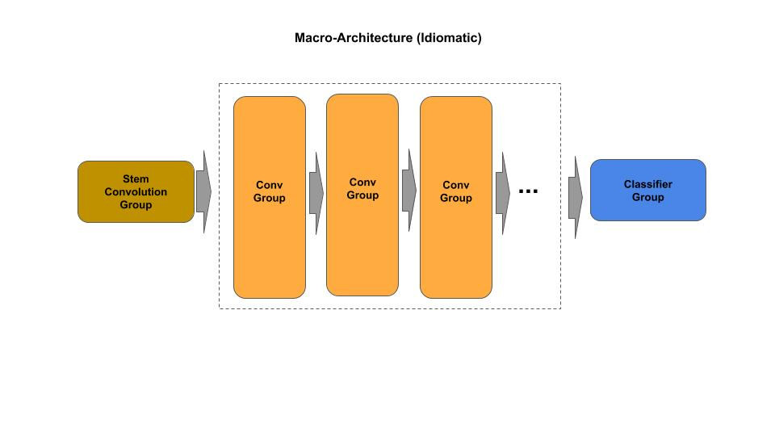
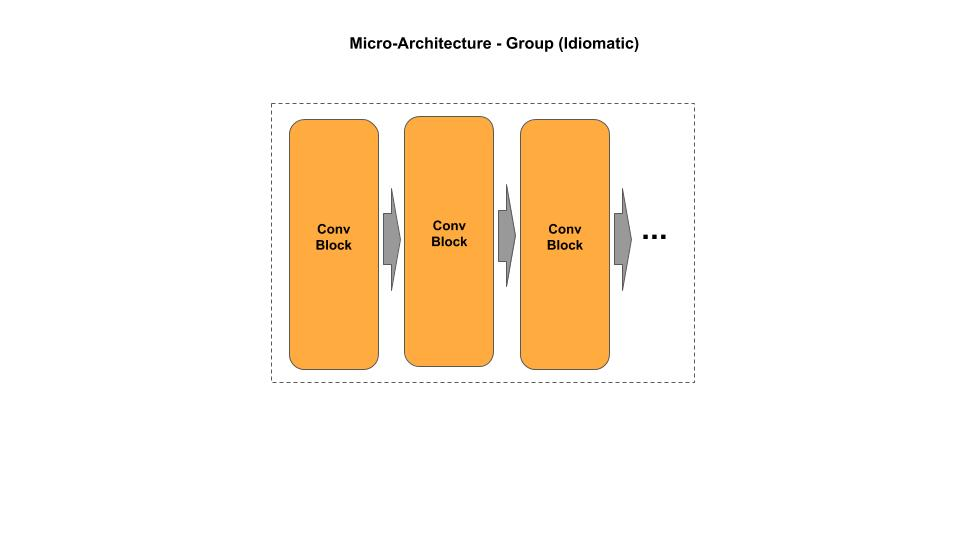

# Model Zoo

All the models here are coded using design pattern for models. The models are based on their corresponding research paper and presented in two design patterns:

  1. Idiomatic - procedural: for academic/educational audience.
  2. Composable (end in _c.py) - object oriented programming: for production audience.

| Model       | Paper |
|--------------|-------|
|*Deep Convolutional Neural Networks*||
| [`AlexNet`](alexnet) | [ImageNet Classification with Deep Convolutional Neural Networks, 2012](https://papers.nips.cc/paper/4824-imagenet-classification-with-deep-convolutional-neural-networks.pdf)|
| [`ZFNet`](zfnet) | [Visualizing and Understanding Convolutional Networks, 2013](https://arxiv.org/pdf/1311.2901v3.pdf) |
| [`VGG16`](vgg)     | [Very Deep Convolutional Networks for Large-Scale Image Recognition, 2014](https://arxiv.org/pdf/1409.1556.pdf) |
| [`VGG19`](vgg)     | [Very Deep Convolutional Networks for Large-Scale Image Recognition, 2014](https://arxiv.org/pdf/1409.1556.pdf) |
|*Residual Convolutional Neural Networks*||
| [`ResNet34`](resnet)  | [Deep Residual Learning for Image Recognition, 2015](https://arxiv.org/pdf/1512.03385.pdf) |
| [`ResNet50`](resnet)  | [Deep Residual Learning for Image Recognition, 2015](https://arxiv.org/pdf/1512.03385.pdf) |
| [`ResNet101`](resnet) | [Deep Residual Learning for Image Recognition, 2015](https://arxiv.org/pdf/1512.03385.pdf) |
| [`ResNet152`](resnet) | [Deep Residual Learning for Image Recognition, 2015](https://arxiv.org/pdf/1512.03385.pdf) |
| [`ResNet_cifar10`](resnet) | [Deep Residual Learning for Image Recognition, 2015](https://arxiv.org/pdf/1512.03385.pdf) |
| [`ResNet50_v1.5`](resnet)  | [Deep Residual Learning for Image Recognition, 2015](https://arxiv.org/pdf/1512.03385.pdf) |
| [`ResNet50_v2.0`](resnet)  | [Identity Mappings in Deep Residual Networks, 2016](https://arxiv.org/pdf/1603.05027.pdf) |
| [`ResNet_cifar10_v2.0`](resnet)  | [Identity Mappings in Deep Residual Networks, 2016](https://arxiv.org/pdf/1603.05027.pdf) |
| [`SE-ResNet50`](senet)    | [Squeeze-and-Excitation Networks, 2017](https://arxiv.org/pdf/1709.01507.pdf) |
| [`SE-ResNet101`](senet)   | [Squeeze-and-Excitation Networks, 2017](https://arxiv.org/pdf/1709.01507.pdf) |
| [`SE-ResNet152`](senet)   | [Squeeze-and-Excitation Networks, 2017](https://arxiv.org/pdf/1709.01507.pdf) |
|*Wide Convolutional Neural Networks*||
| [`Inception_v1`](inception)   | [Going Deeper with Convolutions, 2015](https://arxiv.org/pdf/1409.4842.pdf)   |
| [`Inception_v2`](inception)   | [Going Deeper with Convolutions, 2015](https://arxiv.org/pdf/1409.4842.pdf)   |
| [`Inception_v3`](inception)   | [Rethinking the Inception Architecture for Computer Vision, 2015](https://arxiv.org/pdf/1512.00567.pdf) |
| [`ResNeXt50`](resnext)  | [Aggregated Residual Transformations for Deep Neural Networks, 2016](https://arxiv.org/pdf/1611.05431.pdf) |
| [`ResNeXt101`](resnext) | [Aggregated Residual Transformations for Deep Neural Networks, 2016](https://arxiv.org/pdf/1611.05431.pdf) |
| [`ResNeXt152`](resnext) | [Aggregated Residual Transformations for Deep Neural Networks, 2016](https://arxiv.org/pdf/1611.05431.pdf) |
| [`ResNeXt_cifar10`](resnext) | [Aggregated Residual Transformations for Deep Neural Networks, 2016](https://arxiv.org/pdf/1611.05431.pdf) |
| [`WRN`](wrn)        | [Wide Residual Networks, 2016](https://arxiv.org/pdf/1605.07146.pdf) |
| [`Xception`](xception)   | [Xception: Deep Learning with Depthwise Separable Convolutions, 2016](https://arxiv.org/pdf/1610.02357.pdf) |
| [`SE-ResNeXt50`](senet)    | [Squeeze-and-Excitation Networks, 2017](https://arxiv.org/pdf/1709.01507.pdf) |
| [`SE-ResNeXt101`](senet)   | [Squeeze-and-Excitation Networks, 2017](https://arxiv.org/pdf/1709.01507.pdf) |
| [`SE-ResNeXt152`](senet)   | [Squeeze-and-Excitation Networks, 2017](https://arxiv.org/pdf/1709.01507.pdf) |
|*Densely Connected Convolutional Neural Networks*||
| [`DenseNet121`](densenet) | [Densely Connected Convolutional Networks, 2016](https://arxiv.org/pdf/1608.06993.pdf) |
| [`DenseNet169`](densenet) | [Densely Connected Convolutional Networks, 2016](https://arxiv.org/pdf/1608.06993.pdf) |
| [`DenseNet201`](densenet) | [Densely Connected Convolutional Networks, 2016](https://arxiv.org/pdf/1608.06993.pdf) |
|*Mobile Networks*||
| [`MobileNet v1`](mobilenet) | [MobileNets: Efficient Convolutional Neural Networks for Mobile VisionApplications, 2017](https://arxiv.org/pdf/1704.04861.pdf) |
| [`MobileNet v2`](mobilenet) | [MobileNetV2: Inverted Residuals and Linear Bottlenecks, 2019](https://arxiv.org/pdf/1801.04381.pdf) |
| [`MobileNet v3 small`](mobilenet) | [Searching for MobileNetV3, 2019](https://arxiv.org/pdf/1905.02244.pdf) |
| [`MobileNet v3 large`](mobilenet)| [Searching for MobileNetV3, 2019](https://arxiv.org/pdf/1905.02244.pdf) |
| [`SqueezeNet`](squeezenet) |  [SqueezeNet: AlexNet-level accuracy with 50x fewer parameters and <0.5MB model size, 2016](https://arxiv.org/pdf/1602.07360.pdf) |
| [`SqueezeNet_bypass`](squeezenet) |  [SqueezeNet: AlexNet-level accuracy with 50x fewer parameters and <0.5MB model size, 2016](https://arxiv.org/pdf/1602.07360.pdf) |
| [`SqueezeNet_complex`](squeezenet) |  [SqueezeNet: AlexNet-level accuracy with 50x fewer parameters and <0.5MB model size, 2016](https://arxiv.org/pdf/1602.07360.pdf) |
| [`ShuffleNet`](shufflenet) | [ShuffleNet: An Extremely Efficient Convolutional Neural Network for Mobile Devices, 2017](https://arxiv.org/pdf/1707.01083.pdf) |
|*One-Shot Classification Networks*||
| [`Siamese Twin`](siamese_twin) | [Siamese Neural Networks for One-shot Image Recognition, 2015](https://www.cs.cmu.edu/~rsalakhu/papers/oneshot1.pdf) |
|*AutoEncoders*||
| [`Auto Encoder`](autoencoder) | no paper - general principles |
| [`SRCNN`](srcnn) | [Image Super-Resolution Using Deep Convolutional Networks](https://arxiv.org/pdf/1501.00092.pdf)
|*Generative Adversarial Networks*||
| [`DCGAN`](dcgan) | [Unsupervised Representation Learning with Deep Convolutional Generative Adversarial Networks, 2016](https://arxiv.org/pdf/1511.06434.pdf) |
|*Object Dectection*||
| [`R-CNN`](r-cnn) |[Rich feature hierarchies for accurate object detection and semantic segmentation, 2014](https://arxiv.org/pdf/1311.2524.pdf)|
| [`Fast R-CNN`](fast r-cnn) |[Fast R-CNN, 2015](https://arxiv.org/pdf/1504.08083.pdf)|
| [`Faster R-CNN`](faster r-cnn) |[Faster R-CNN: Towards Real-Time Object Detection with Region Proposal Networks, 2015](https://arxiv.org/pdf/1506.01497.pdf)|
|*Image Segmentation*||
| [`U-Net`](unet) |[U-Net: Convolutional Networks for Biomedical Image Segmentation, 2015](https://arxiv.org/abs/1505.04597)|

## Architecture Representation

The architecture representation of models consists of an overall macro-architecture and a micro-architecture.

### Macro-Architecture

The macro architecture consists of a stem (entry) group, a collection of groups (middle), and a classifier group (exit). The number of groups is defined by the macro architecture. The macro architecture may optionally contain a pre-stem, which perform additional operations, such as data preprocessing, model aggregation, and prediction post-processing.

### Micro-Architecture

The micro architecture consists of a collection of blocks, which collectively form a group. A block consists of an input and an output, and within the block is a set of layers connected by the block pattern. The number of blocks and the block pattern is defined by the meta-parameters (where parameters are the weights/biases learned, and hyper-parameters are the parameters used to train the model, but not part of the model).

