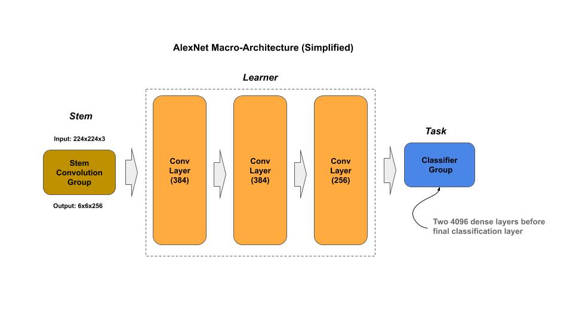
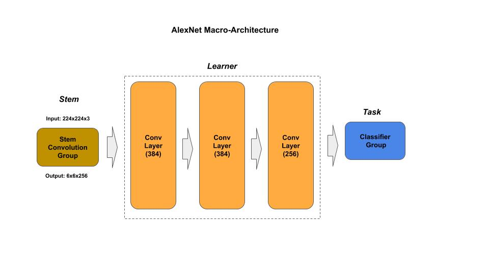
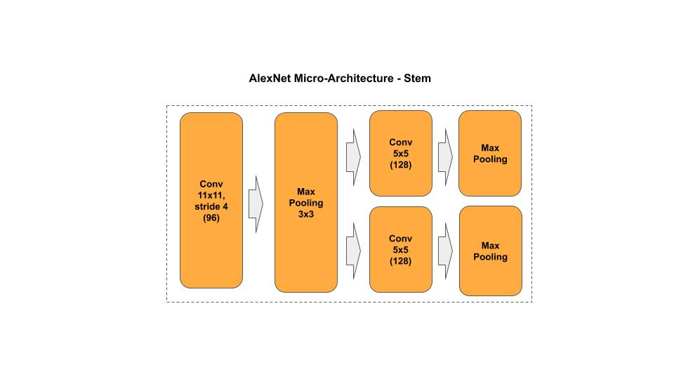

# AlexNet

[alexnet.py](alexnet.py) - simplified (single path) academic (idiomatic) 
[alexnet_p.py](alexnet.py) - original (dual path) academic (idiomatic) 

[Paper](https://papers.nips.cc/paper/4824-imagenet-classification-with-deep-convolutional-neural-networks.pdf)

## Macro-Architecture

### Simplified

### Paper

## Micro-Architecture

### Stem

### Classifier

