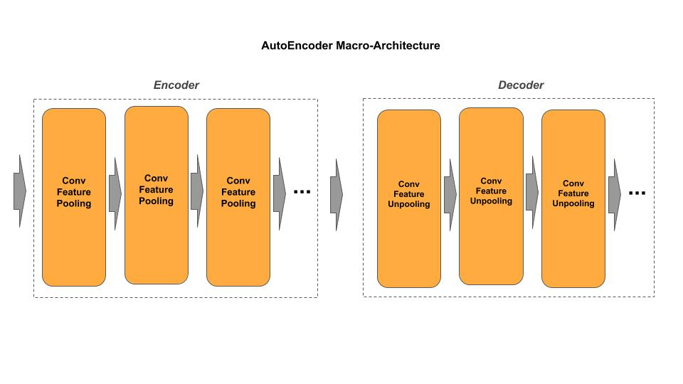
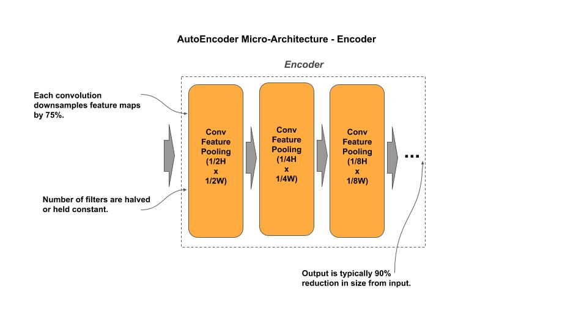
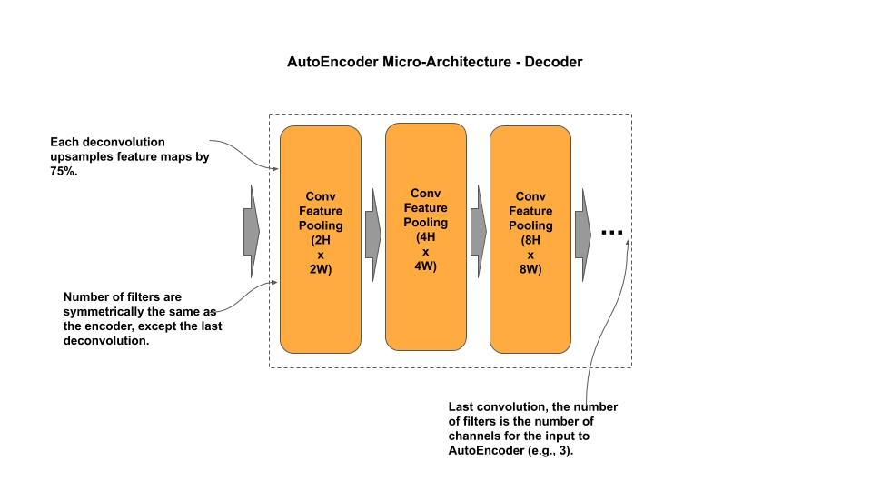

# AutoEncoder

[autoencoder.py](autoencoder.py) - academic (idomatic)<br/>
[autoencoder_c.py](autoencoder_c.py) - production (composable)


## Macro-Architecture



## Micro-Architecture 

### Encoder



### Decoder




## Composable

*Example Instantiate a AutoEncoder model*

```python
from autoencoder_c import AutoEncoder

# Create an AutoEncoder for 32x32x3 (CIFAR-10)
autoencoder = AutoEncoder()

# Create a custom AutoEncoder
autoencoder = AutoEncoder(input_shape=(128, 128, 3), layers=[128, 64, 32])
```
