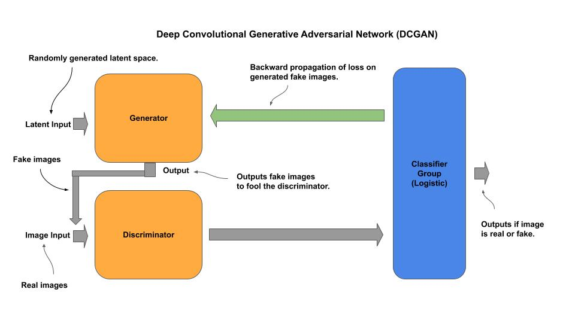
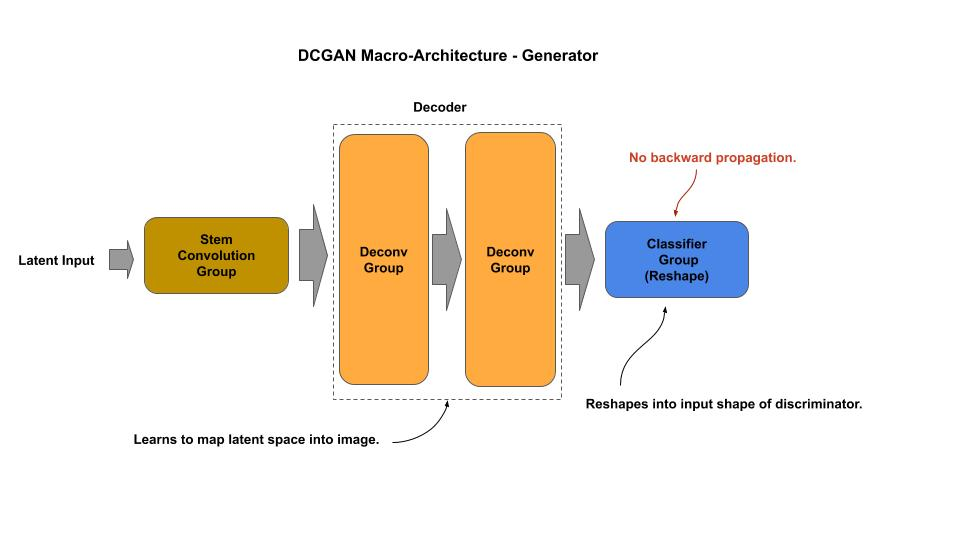
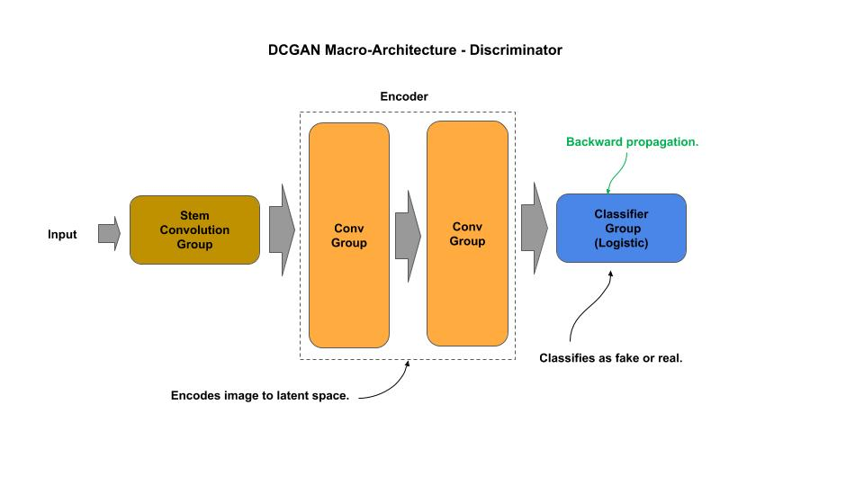

# DCGAN

[dcgan_c.py](dcgan_c.py) - production (composable)


[Paper](https://arxiv.org/pdf/1511.06434.pdf)

## Macro-Architecture



### Generator



### Discriminator



## Composable

*Example: Compose and Train for CIFAR-30*

```
gan = DCGAN(input_shape=(32, 32, 3))
gan.model.summary()

from tensorflow.keras.datasets import cifar10
import numpy as np
(x_train, _), (_, _) = cifar10.load_data()
x_train = x_train / 127.5 - 1.
gan.train(x_train, latent=100, epochs=6000)
 ```
