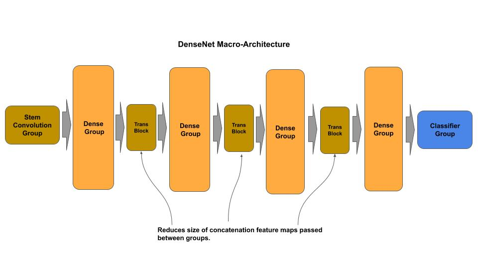
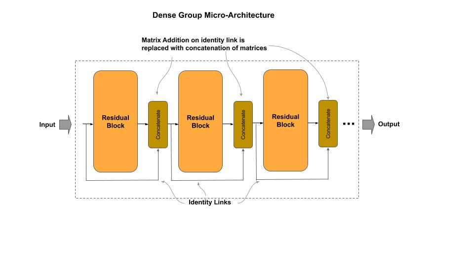
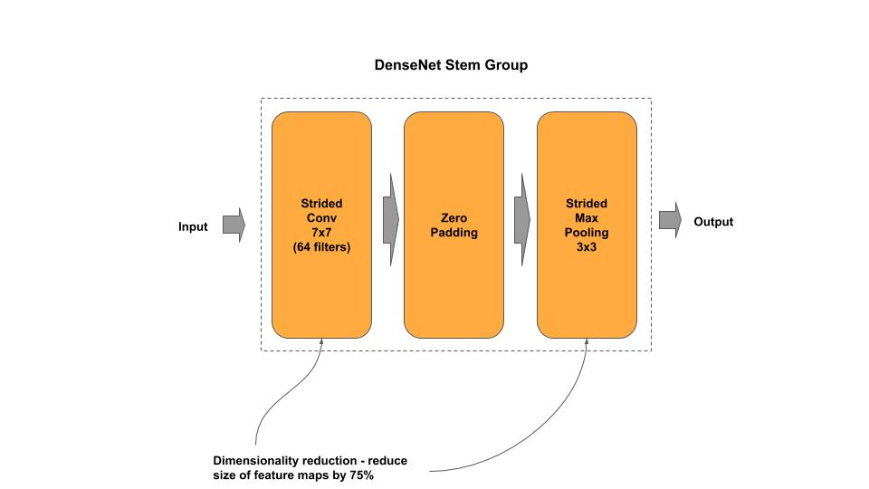
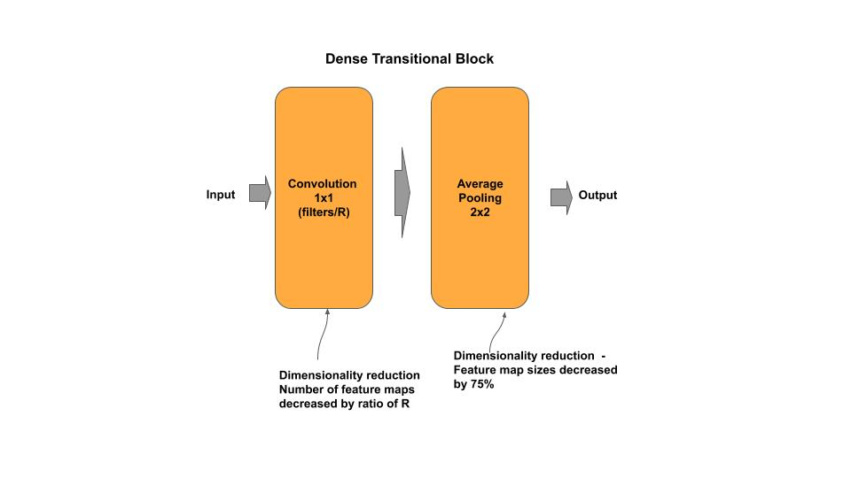
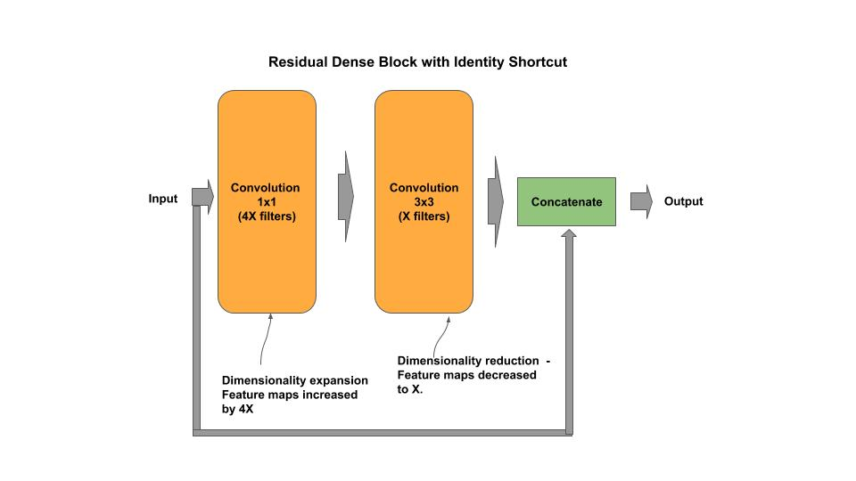

# DenseNet

[densenet.py](densenet.py) - academic (idiomatic)<br/>
[densenet_c.py](densenet_c.py) - production (composable)


[Paper](https://arxiv.org/pdf/1608.06993.pdf)

## Macro-Architecture



## Micro-Architecture



### Stem Group



### Dense Block


### Transitional Block



### Residual Block



### Classifier


## Composable

*Example Instantiate a stock DenseNet model*

```python
from densenet_c import DenseNet

# DenseNet121 from research paper
densenet = DenseNet(121)

# DenseNet121 custom input shape/classes
densenet = DenseNet(121, input_shape=(128, 128, 3), n_classes=50)

# getter for the tf.keras model
model = densenet.model
```

*Example: Composable a Train a DenseNet*

```python
''' Example for constructing/training a DenseNet model on CIFAR-10
'''
# Example of constructing a mini-DenseNet
groups = [ { 'n_blocks': 3 }, { 'n_blocks': 6 }, { 'n_blocks': 12 } ]
densenet = DenseNet(groups, input_shape=(32, 32, 3), n_classes=10)
densenet.model.summary()
densenet.cifar10()
```
