# Inception

[inception(v1/v2/v3).py](inception_v1.py) - academic (idiomatic)<br/>
[inception_(v1/v2/v3)_c.py](inception_v1_c.py) - production (composable)

[Paper V1/V2](https://arxiv.org/pdf/1409.4842.pdf)<br/>
[Paper V3](https://arxiv.org/pdf/1512.00567.pdf)
[Corrected Paper V3](https://www.cv-foundation.org/openaccess/content_cvpr_2016/papers/Szegedy_Rethinking_the_Inception_CVPR_2016_paper.pdf)

   The paper submitted to ARXIV, and last revised on Dec 11, 2015, has some typos in it that were addressed with a revision    that is stored on CV-Foundation. Mostly notably, correctly the reference to the model submitted to the ILSVRC 2015 image    classification (1st runner up), from V2 to V3.
   
   It is generally agreed that V2 is the same as V1 with the additional of batch normalization, but no additional   
   factorization.
   
   The later paper continues to have the typos in Table 1. Per my discussion with two of the paper's authors:
   
   Sergey Ioffe: *The inception v3 model has been opensourced. Please see         
   https://github.com/tensorflow/models/blob/master/research/inception/inception/slim/inception_model.py (which also cites 
   the paper where this model was described).*
   
   Christian Szegedy: *I agree with Sergey that the implementation serves as the best reference.*

    inception_(v1/v2/v3).py - academic - procedural
    inception_(v1.v2/v3)_c.py - composable - OOP
    
Below is the corrected version of Table 1 in the paper for V3:
   
| type        | patch size/stride .    | input size | note  
| ------------| ---------------------- |------------|-----------|
| conv        |         3x3/2          | 299x299x3  ||
| conv        |         3x3/1          | 149x149x32 ||
| conv padded |         3x3/1          | 147x147x32 ||
| pool        |         3x3/2          | 147x147x64 ||
| conv        |         3x3/1          | 73x73x64   ||
| conv        |         3x3/2          | 71x71x80   ||
| **pool**    |         3x3/2          | 35x35x192  | incorrectly listed as conv |
| 3xinception | **fig. 4/with double 3x3** | 35x35x288  | incorrectly listed as fig. 5, includes grid reduction fig. 10|
| 5xinception | fig. 6                 | 17x17x768 | includes grid reduction, no fig. |
| 2xinception | fig. 7                 | 8x8x1280  ||
| **ave** pool | 8x8                   | 8x8x2048  ||
| linear      | logits                 | 1x1x2048  ||
| softmax     | classifier             | 1x1x1000 ||


## Macro-Architecture v1.0 and v2.0

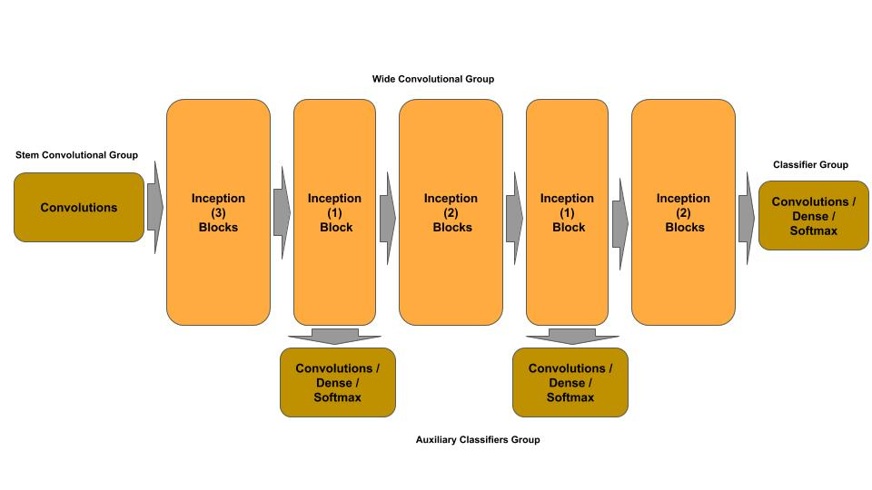

## Macro-Architecture v3.0


## Micro-Architecture v1.0 and v2.0

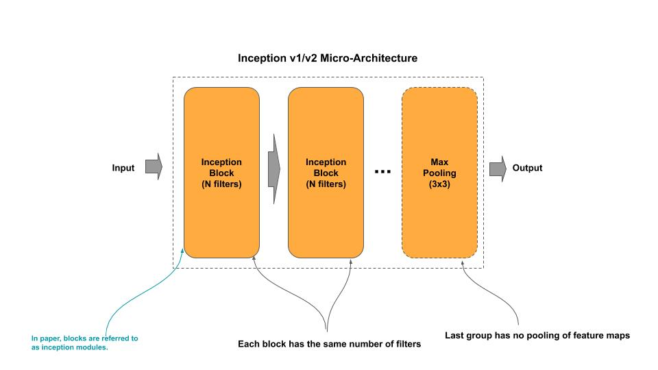

## Micro-Architecture v3.0

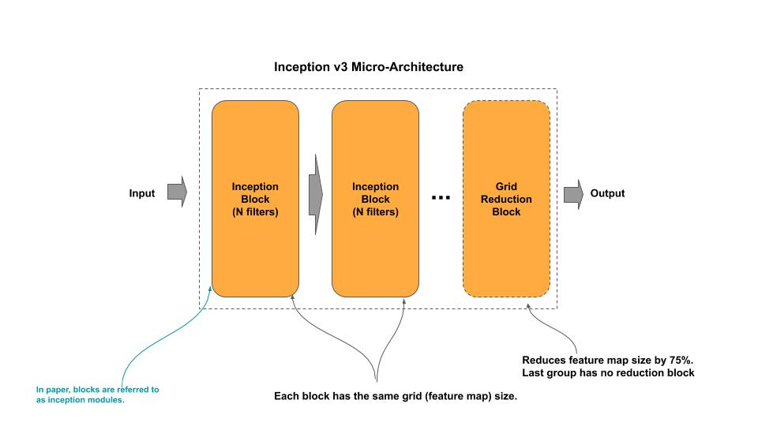

### Stem v1.0

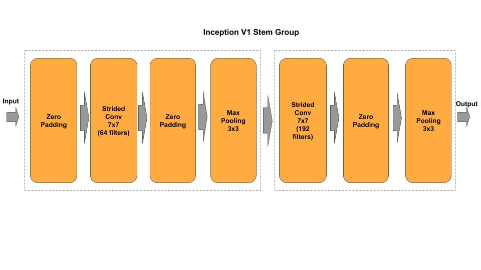

### Stem v2.0

Adds batch normalization to the convolutional layers and uses the common convention to drop biases in the convolutional layer when it is followed by batch normalization.

### Stem v3.0

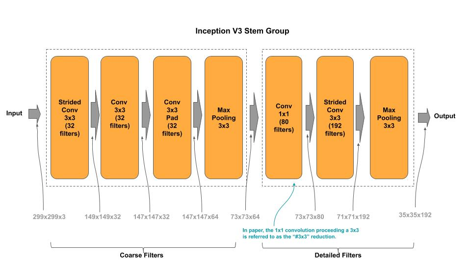

### Stem v4.0

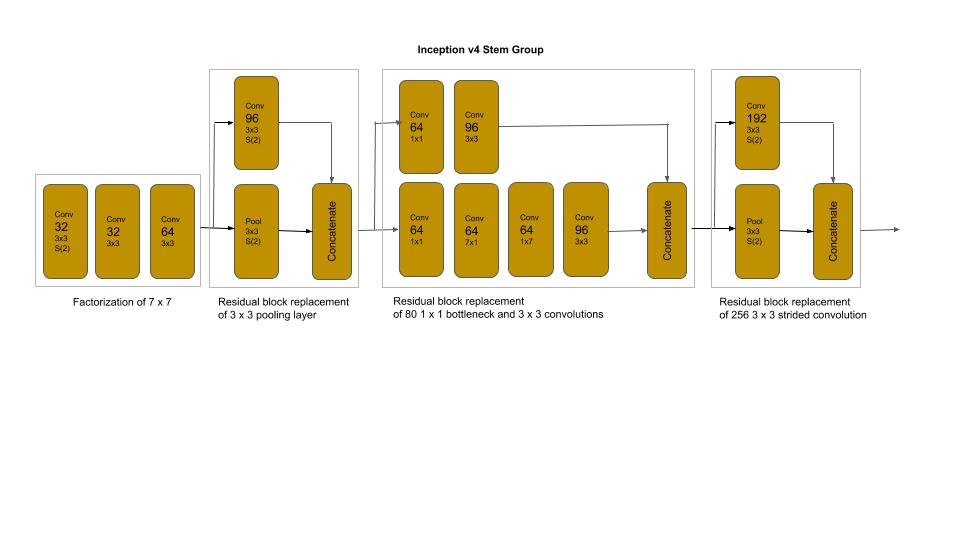

### Inception Block v1.0

Adds batch normalization to the convolutional layers and uses the common convention to drop biases in the convolutional layer when it is followed by batch normalization.

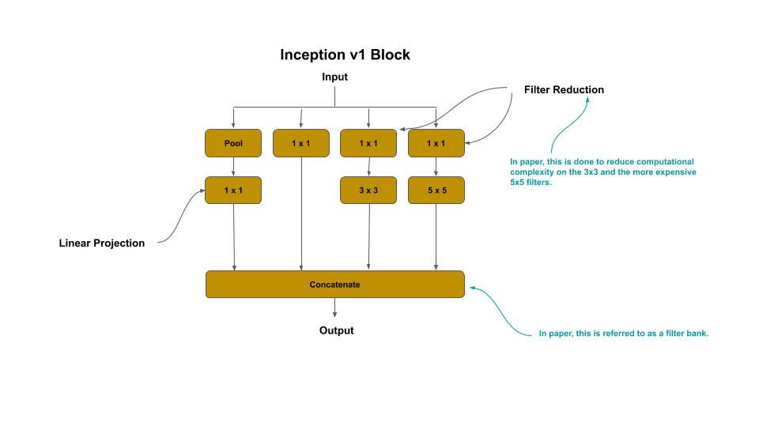

### Inception Block v2.0

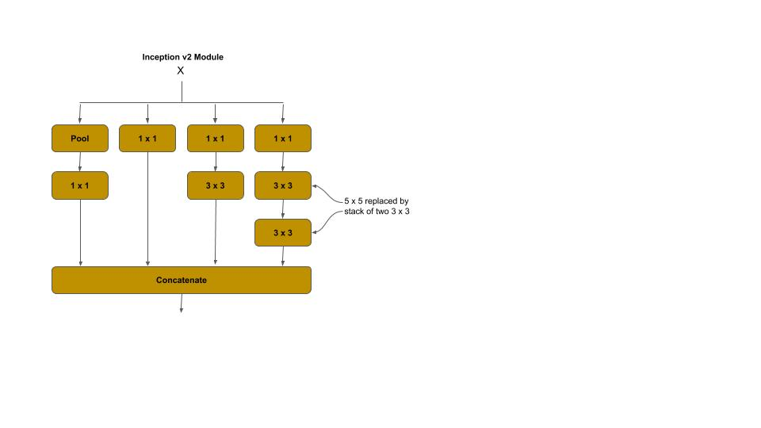

### Inception Block v3.0

#### Inception Block for 35 x 35 grid

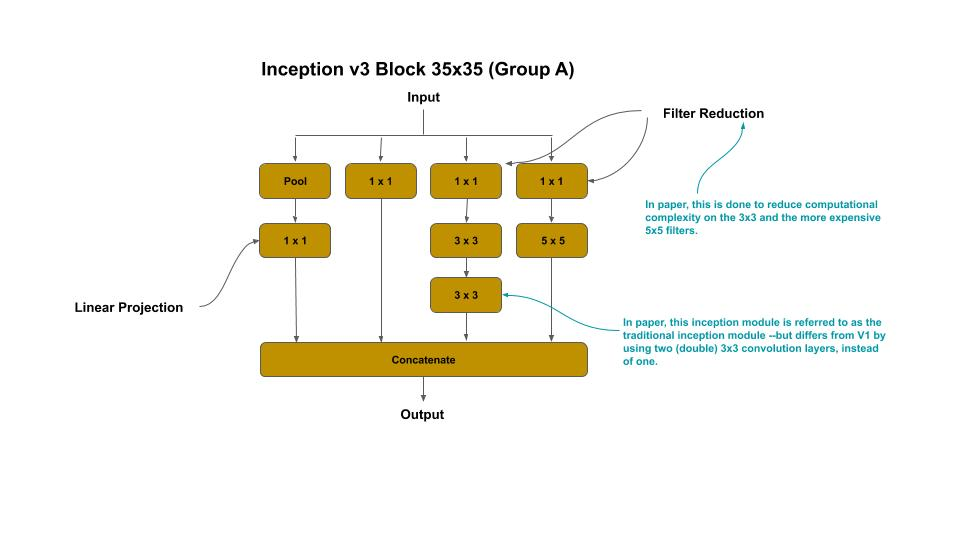

#### Reduction Block to 17 x 17 Grid

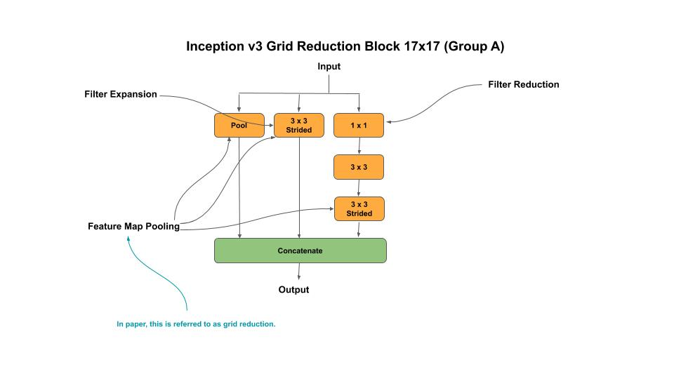

#### Inception Block 17 x 17 Grid

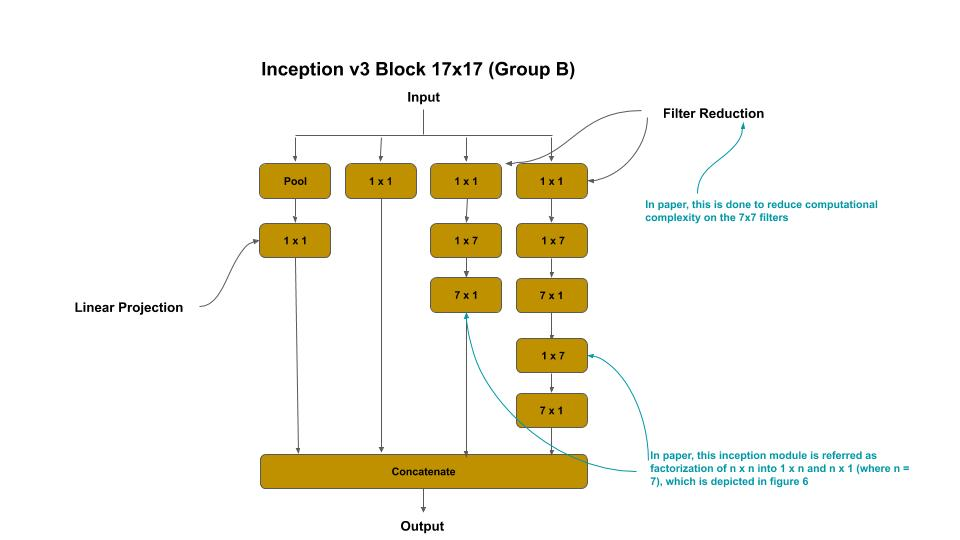

#### Reduction Block to 8 x 8 Grid

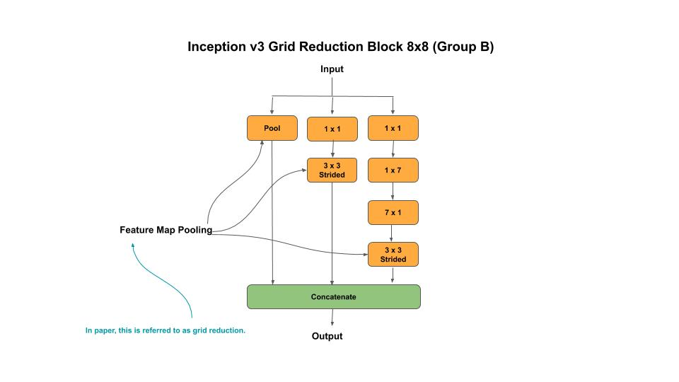

#### Inception Block 8 x 8 Grid

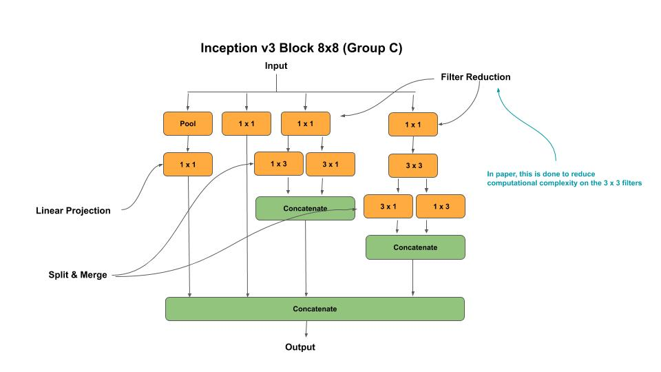

### Classifier v1.0, v2.0 & v3.0

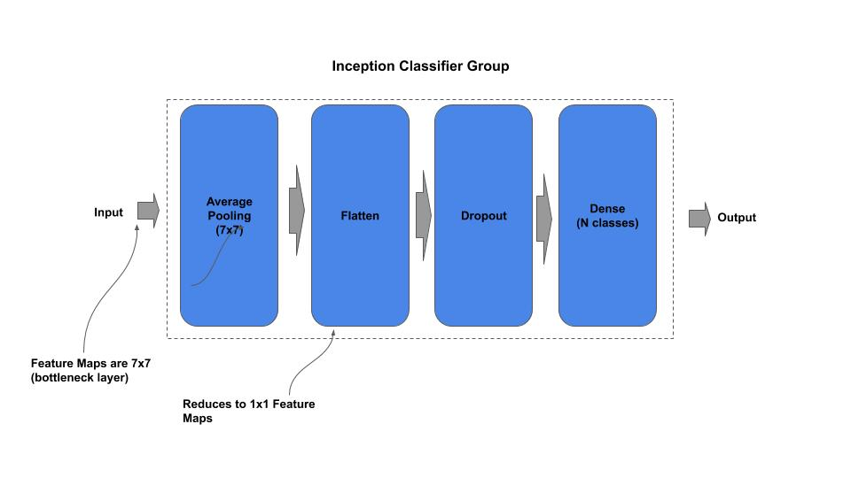

### Auxiliary Classifier v1.0 & v2.0

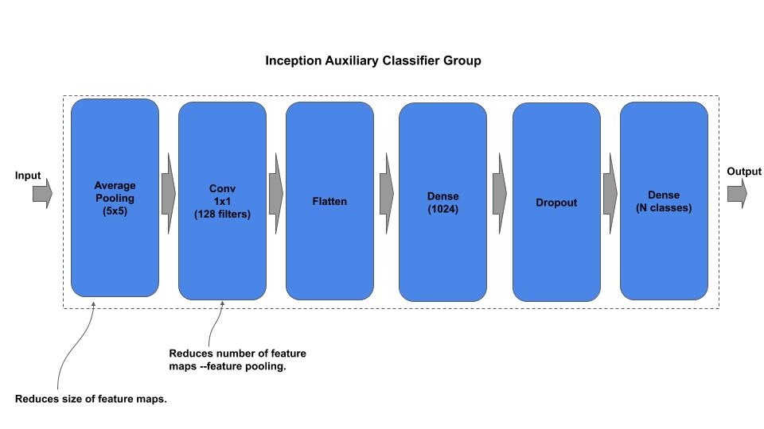

### Auxiliary Classifier v3.0

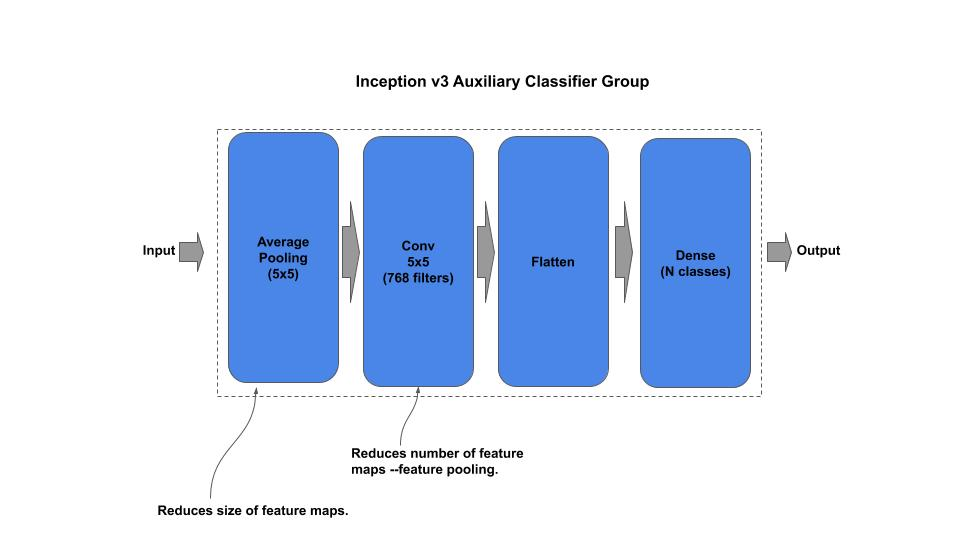


## Composable

*Example: Instantiate a stock Inception V1 model*

```python
from inception_v1_c import InceptionV1

# Inception V1 from research paper
inception = InceptionV1()

# InceptionV1 custom input shape/classes
inception = InceptionV1(input_shape=(128, 128, 3), n_classes=50)

# getter for the tf.keras model
model = inception.model
```

*Example: Compose and Train an Inception V1 model*

```python
```

