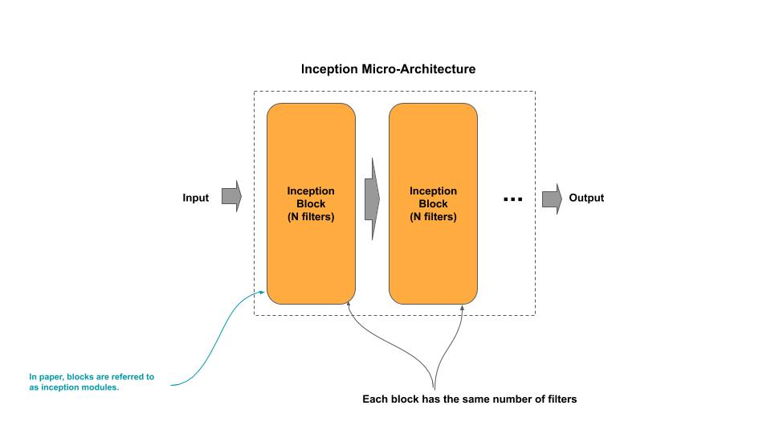

# Inception v1

[Paper]()

## Macro-Architecture


```python
def learner(x, n_classes):
    """ Construct the Learner
        x        : input to the learner
        n_classes: number of output classes
    """
    # Group 3
    x = group(x, [((64,),  (96,128),   (16, 32), (32,)),  # 3a
                  ((128,), (128, 192), (32, 96), (64,))]) # 3b

    # Group 4
    x = group(x, [((192,),  (96, 208), (16, 48), (64,)), # 4a
                  None, 				 # auxiliary classifier
                  ((160,), (112, 224), (24, 64), (64,)), # 4b
                  ((128,), (128, 256), (24, 64), (64,)), # 4c
                  ((112,), (144, 288), (32, 64), (64,)), # 4d
                  None,                                  # auxiliary classifier
                  ((256,), (160, 320), (32, 128), (128,))], # 4e
                  n_classes=n_classes) 

    # Group 5
    x = group(x, [((256,), (160, 320), (32, 128), (128,)), # 5a
                  ((384,), (192, 384), (48, 128), (128,))],# 5b
                 pooling=False) 
    return x

# Meta-parameter: dropout percentage
dropout = 0.4

# The input tensor
inputs = Input(shape=(224, 224, 3))

# The stem convolutional group
x = stem(inputs)

# The learner
x = learner(x, 1000)

# The classifier for 1000 classes
outputs = classifier(x, 1000, dropout)

# Instantiate the Model
model = Model(inputs, outputs)
```

## Micro-Architecture



```python
def group(x, blocks, pooling=True, n_classes=1000):
    """ Construct an Inception group
        x         : input into the group
        blocks    : filters for each block in the group
        pooling   : whether to end the group with max pooling
        n_classes : number of classes for auxiliary classifier
    """
    # Construct the inception blocks (modules)
    for block in blocks:
        # Add auxiliary classifier
        if block is None:
            auxiliary(x, n_classes)
        else:
            x = inception_block(x, block[0], block[1], block[2], block[3])           

    if pooling:
        x = ZeroPadding((1, 1))(x)
        x = MaxPooling2D((3, 3), strides=2)(x)
    return x
```
### Stem v1.0


```python
def stem(inputs):
    """ Construct the Stem Convolutional Group 
        inputs : the input vector
    """
    # The 224x224 images are zero padded (black - no signal) to be 230x230 images prior to the first convolution
    x = ZeroPadding2D(padding=(3, 3))(inputs)

    # First Convolutional layer which uses a large (coarse) filter
    x = Conv2D(64, (7, 7), strides=(2, 2), padding='valid', activation='relu', kernel_initializer='glorot_uniform')(x)

    # Pooled feature maps will be reduced by 75%
    x = ZeroPadding2D(padding=(1, 1))(x)
    x = MaxPooling2D((3, 3), strides=(2, 2))(x)

    # Second Convolutional layer which uses a mid-size filter
    x = Conv2D(64, (1, 1), strides=(1, 1), padding='same', activation='relu', kernel_initializer='glorot_uniform')(x)
    x = ZeroPadding2D(padding=(1, 1))(x)
    x = Conv2D(192, (3, 3), strides=(1, 1), padding='valid', activation='relu', kernel_initializer='glorot_uniform')(x)

    # Pooled feature maps will be reduced by 75%
    x = ZeroPadding2D(padding=(1, 1))(x)
    x = MaxPooling2D((3, 3), strides=(2, 2))(x)
    return x
```

### Stem v4.0


### Inception Block v2.0


