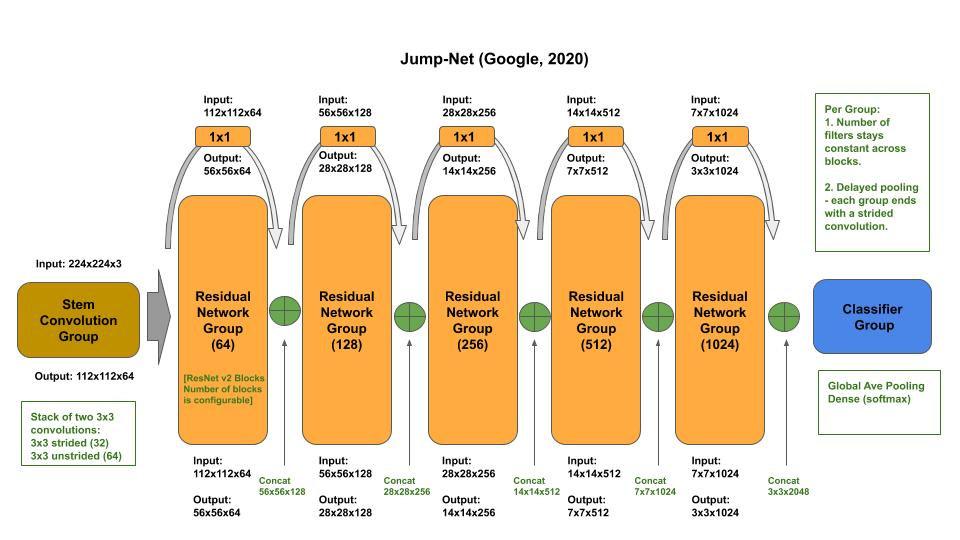

# JumpNet

[jumpnet.py](jumpnet.py) - academic (idiomatic) 
[jumpnet_c.py](jumpnet_c.py) - production (composable)

[Paper](tba)

## Macro-Architecture

## Micro-Architecture

### Stem Group

### Residual Block

## Draft for Paper / Abalation Study (on-going)

Abstract: A human crafted (without machine assistance) model design for improving residual convolution networks accuracy with fewer parameters and less depth requirements. I compare my design, and subsequent study, to three previous SOTA residual convolution networks, based on deep layers: ResNet v2 (2016) [7], DenseNet (2016) [8], and SparseNet (2018) [9].

Each of these former architectures established new best practices for increasing accuracy, increasing capacity with deeper layers, minimizing parameters and matrix multiple operations, above best practices of former SOTA residual convolution network architectures.

The Jump-Net architecture is designed to incorporate the prior best practised by ResNet v2 [7], DenseNet [8] and SparseNet [9], and introduces a new skip connection, which I refer to as a group jump link. This new skip connection further minimizes the number of parameters and matmul operations, while preserving accuracy and without going deeper in layers.

<TODO- Summarize ablation study>

### Introduction:

We propose a new architecture that fine tunes improvements proposed by SparseNet for residual neural networks. The authors, Liu and Zeng, made observations on inefficiencies in feature reuse between residual blocks by the ResNet v2 and DenseNet designs. They observed that using the matrix add operation to reuse features between residual blocks, that the earlier features become more and more diluted, and as the network goes deeper, information from the early layers is effectively lost. They observed that the approach in DenseNet of using a matrix concatenation operation solved the dilution, but they observed that as the concatenated feature maps, from earlier layers, are aggressively downsized, that in later layers the feature maps become sparse. That is, the values tend towards zero; thereby losing all reusable information.

SparseNet uses the DenseNet approach of concatenating feature maps for reuse, but differs by proposing using an exponential selection for reuse between residuals blocks. That is, instead of concatenating the feature map input to the output of each block, they exponentially (powers of 2) increased the distance between blocks for concatenation. For example, the first concatenated feature maps occur one block away, the second at two blocks away, the third at 4 blocks away, the fourth at 8 blocks away, etc. They refer to this style of feature map concatenation as sparse. They theorized that by making the connections increasingly sparse, it would alleviate the need for aggressive feature map reductions between groups, as in the transitional block in DenseNet, and prevent the early concatenated feature maps from becoming sparse, tending to zeros, in deeper layers.

The choice of using an exponential selection appears arbitrary, and may in fact limit the usefulness of the technique proposed in SqueezeNet. For example, since the number of blocks in a group is configurable, one would have feature map concatenation links breaking out of arbitrary blocks inside groups into arbitrary blocks in subsequent groups. This appears to potentially undermine configuring the optimal number of blocks per group before group pooling of the feature maps.

Further this raises the question of how friendly this selection algorithm would be to macro architecture search. Currently, machine design of network architectures are going down two paths, macro and micro architecture search. In the latter (micro), also known as network architecture search (NAS), we explore the search space with convolutional/residual blocks. The former (macro), is a substantially lesser expensive form of search, where the search space is limited to configurable attributes, also known as metaparameters, within convolutional/residual groups based on an architecture template. In macro-architecture search, the effectiveness is based on the expertise of the data scientist in selecting a template and guiding the search space relating to the metaparameters.

I propose a different approach to the benefits of the sparse concatenated feature map reuse, whereby the sparse connections are between group boundaries, herein referred to as group jump links. As such, the number of blocks within the group can be optimized during macro-architecture search independent of the group jump link.

### Related Work:

#### AlexNet

AlexNet [1], winner of the 2012 ILSVRC challenge for image classification using a convolutional neural network brought both deep learning and convolutional neural networks into the research mainstay for solving imaging related tasks. Using convolutional neural networks demonstrated significant gains in accuracy and reduction in training time. AlexNet incorporated the following design principles:

Using convolutional layers for feature extraction in place of the convention of using dense layers.
Using a rectified linear unit (ReLU) in place of the convention of a hyperbolic tangent (tanh) activation function. The authors stated that they achieved a 25% error rate on CIFAR-10 six times faster than using a tanh.
Using a Dropout layer to reduce overfitting, which they referred to as a recently developed regularization method [10].
Using max pooling between (some) convolutional layers for summarizing the neighboring outputs of neurons in the same kernel.

The stem component (first convolutional layer(s)) consisted of two convolutional layers, which is followed by a max pooling layer. The first convolutional layer used an extremely coarse level filter size of 11x11 with a stride of 4, for 96 outputted feature maps. The second convolutional layer used a filter size of 5x5 with a stride of 1, for 256 outputted feature maps. The max pooling layer used a 3x3 pool size and stride of 2 for a 75% reduction (summarization) in the outputted feature maps.

The learner component consisted of three convolutional layers outputting 384, 384 and 256 feature maps, respectively. A max pooling layer using a 3x3 pool size and stride of 2 follows the first and third convolution.

The task component (classifier) consisted of three dense layers. The first two layers were of size 4096 followed by the final dense layer was of size 1000 for classification, using a softmax activation function.

#### ZFNet

ZFNet [2], winner of the 2013 ILSVRC challenge for image classification, made further improvements to AlexNet. A deconvnet visualization method was developed and used to examine the feature extraction performance at each layer in AlexNet. These visualizations were used to make fine-tuning to AlexNet architecture to improve feature extraction and the model’s accuracy. The observations confirmed that early convolution layers extracted coarse features like edges/corners, then textures and finally later convolution layers extracted object details, like dog legs, faces, and finally entire objects. This demonstrated the importance of going sufficient deep in layers to extract entire objects. The observations demonstrated that the 11x11, stride of 4 initial filter was too large in size and stride, resulting in too much information loss on the first convolution. The observations demonstrated that feature extraction is improved by increasing the number of filters in later layers. 

The fine-tuned AlexNet architecture, referred to as ZFNet, consists of 8 layers. The stem component consisted of two convolutional layers. The first layer was a 7x7 with a stride of 2 convolutions, outputting 96 feature maps. The second convolutional layer used a filter size of 5x5 with a stride of 2, for 256 outputted feature maps. The max pooling layer used a 3x3 pool size and stride of 2 for a 75% reduction (summarization) in the outputted feature maps.

The learner and task components in ZFNet are the same as in AlexNet.

#### GoogLeNet (Inception v1)

GoogLeNet (Inception v1) [4] and VGG [3], 1st place and second place winners of the 2014 ILSVRC challenge for image classification, introduced using a repeating convolutional block pattern, delayed pooling. VGG and ZFNet experimented using the convolutional block patterns to go deeper in layers for more capacity, while GoogLeNet experimented with both going deeper and wider in layers for more capacity. 

GoogLeNet introduced using 1x1 convolutions for dimensionality reduction (bottleneck convolution), in constructed to the introduction of 1x1 convolutions in Network-in-Network (NiN) [11]  which was used to increase representational power. Using a convolution, the model learns the optimal method for reducing dimensionality versus using a static algorithm to remove computational bottlenecks. This method allowed GoogLeNet to go both deeper and wider in layers before degradation in representational power, and vanishing gradient, to add capacity and increase accuracy.

The corresponding paper and subsequent entry in ILSVRC introduced the concept of parallel convolutions using different filter sizes. The authors stated that a single filter size per layer learns a single feature abstraction from the current features, and that other possible feature abstractions from different filter sizes would be lost to subsequent layers. The authors proposed a new block design, referred to as the naive inception module, where the input feature maps are passed in parallel through four separate convolutional/pooling layers of different filter sizes, each outputting extracted features at a different abstraction level. The outputted feature maps from the four abstraction levels are then concatenated together, which was referred to as a filter bank.

The GoogLeNet architecture, referred to as Inception V1, consists of 22 layers. The stem component consisted of three convolutional layers, where a max pooling layer followed the first and third convolutional layers. The first convolutional layer was a 7x7 with a stride of 2 convolutions, outputting 64 feature maps. The second convolutional was a 1x1 bottleneck convolution for reducing computational complexity for the third convolutional layer, which used a filter size of 3x3 with a stride of 1, for 192 outputted feature maps. The max pooling layers used a 3x3 pool size and stride of 2 for a 75% reduction (summarization) in the outputted feature maps.

The learner component is composed of three convolution groups with a total of nine convolutional blocks, referred to as Inception V1 modules. The inception V1 module is based on the native inception module with a 1x1 bottleneck convolution added to the 3x3, 5x5 and max pooling parallel paths.

#### Batch Normalization

The ability to go deeper in layers for more capacity was limited by exploding and vanishing gradients. In exploding gradients, the numerical spread between weights across the network could become so large that the update on one weight could overwhelm tiny updates on other weights -- which would cause the network to diverge instead converge during training. In vanishing gradients, the value of the updated weight could become so small, that it’s floating point value was not representable anymore by the hardware -- which would cause the network to become sparse and lose its capacity during training. 

In the corresponding paper on batch normalization [6], the authors referred to this tendency of the distribution of weight values to expand as one goes deeper in a network as an internal covariate shift. Their proposal was at the output of each convolutional layer, to normalize the values in the outputted feature maps, on each batch. This added stability to weight changes whereby the distribution values of values across batches and across ranges stayed within the same range. 

Using Inception, they demonstrated they could reduce the amount of training steps by 14X while maintaining accuracy. The authors also observed that the normalization of each batch acted as a regularizer -- reducing overfitting -- eliminating the need for dropout.

#### ResNet V1

ResNet V1 (Residual Block Network) [5], 1st place winner of ILSVRC 2015 challenge for image classification, introduced the concept of a residual block design. The authors stated in their paper that by merely stacking more layers to go deeper, and even with adding batch normalization, that the model would eventually face degradation and drop in accuracy instead of increase in accuracy. They observed that this was caused not by overfitting with increased capacity, but by uneven rates of convergence of the layers -- while some layers are still converging, others start diverging.

The authors proposed as a solution to go deeper in layers to increase capacity for more accuracy was to have convolutional blocks learn a residual function, denoted as F(x)+x.

*<TODO - DenseNet >*

*<TODO - Inception v3 redesign>*

*<TODO - SparseNet >*

#### Architecture:

#### Experiments:

#### Conclusion:

#### References:

[1] ImageNet Classification with Deep Convolutional Neural Networks, Krizhesky, et. al., 2012

[2] Visualizing and Understanding Convolutional Networks, Zeiler, et. al., 2014

[3] Very Deep Convolutional Neural Networks for Large Scale Image Recognition, Simonyan, et. al., 2014

[4] Going Deeper with Convolutions, Szegedy, et. al., 2014 - https://arxiv.org/abs/1409.4842

[5] Deep Residual Learning for Image Recognition, He, et. al., 2015 - https://arxiv.org/abs/1512.03385

[6] Batch Normalization: Accelerating Deep Network Training by Reducing Internal Covariate Shift, Ioffe, et. al., 2015

[7] Identity Mappings in Deep Residual Networks, He, et. al., 2016

[8] Densely Connected Convolutional Networks, Huang, et. al., 2016

[9] SparseNet: A Sparse DenseNet for Image Classification, Liu, et. al., 2018

[10] Improving neural networks by preventing co-adaptation of feature detectors, Hinton, et. al, 2012

[11] Network in Network, Lin, et. al, 2014 - https://arxiv.org/abs/1312.4400
