# MobileNet v1.0

[Paper](https://arxiv.org/pdf/1704.04861.pdf)

[mobilenet(v1).py](mobilenet_v1.py) - academic (idiomatic)<br/>
[mobilenet(v1)_c.py](mobilenet_v1_c.py) - production (composable)

## Macro-Architecture

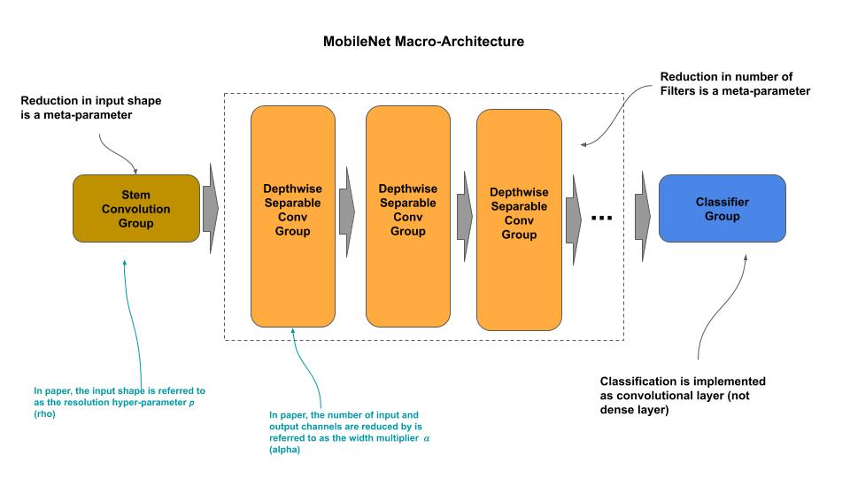

## Micro-Architecture

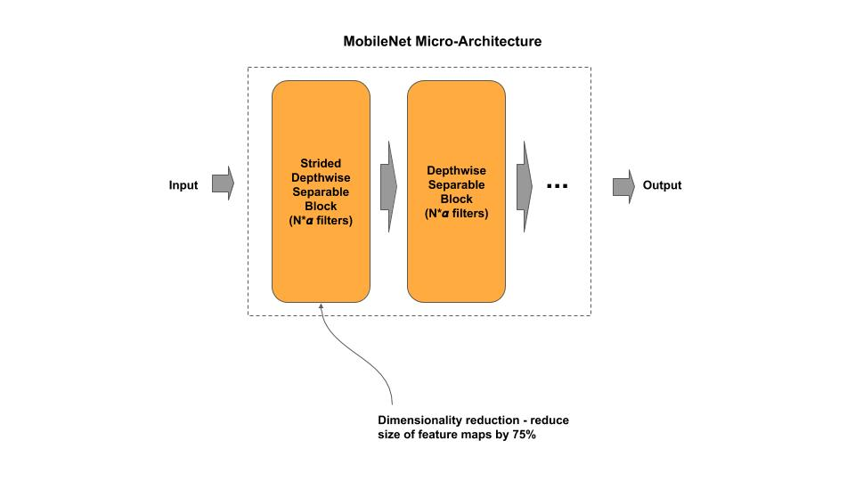

### Stem Group

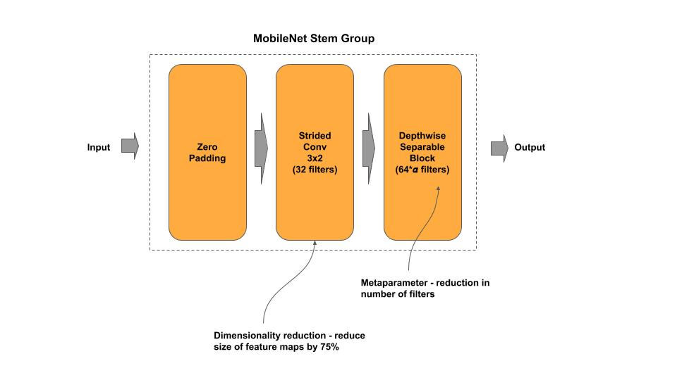

### Depthwise Separable Block

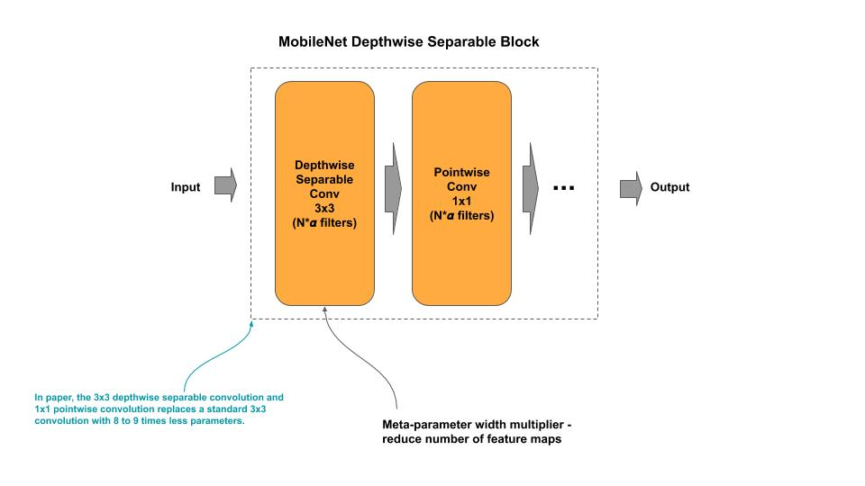

### Strided Depthwise Separable Block

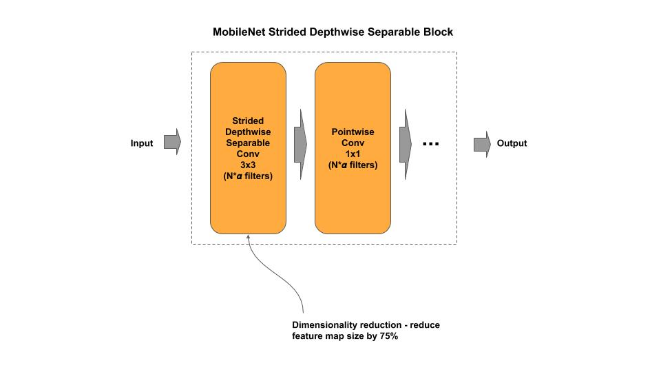

### Classifier Group

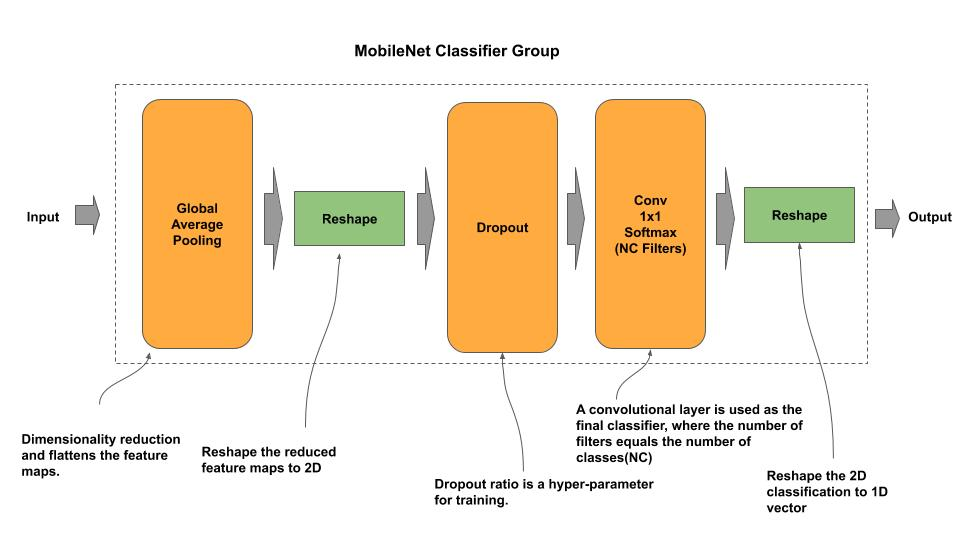

# MobileNet v2.0

[mobilenet(v2).py](mobilenet_v2.py) - academic (idiomatic)<br/>
[mobilenet(v2)_c.py](mobilenet_v2_c.py) - production (composable)

[Paper](https://arxiv.org/pdf/1801.04381.pdf)

## Macro-Architecture

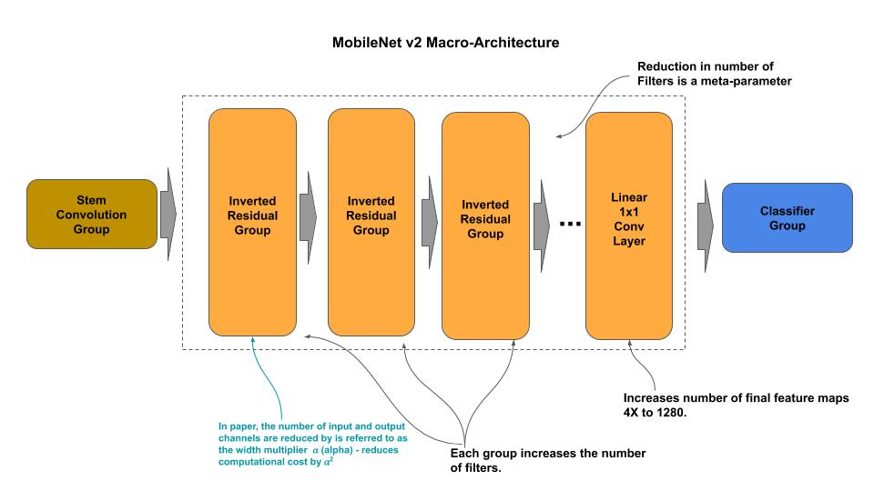

## Micro-Architecture

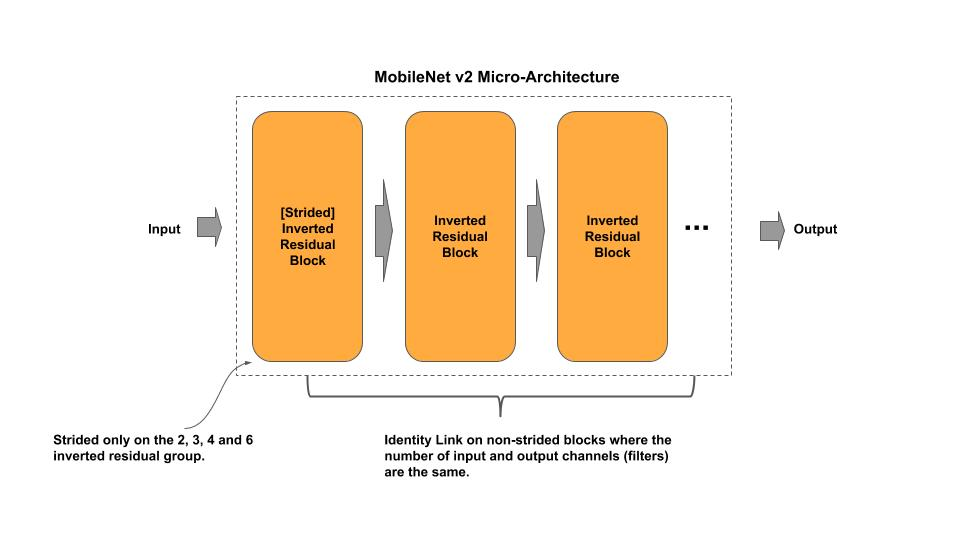

### Stem Group

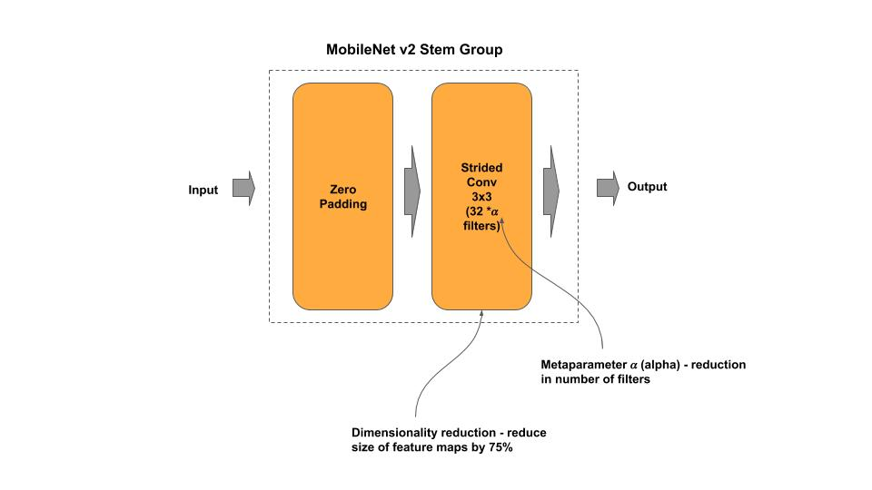

### Inverted Residual Block

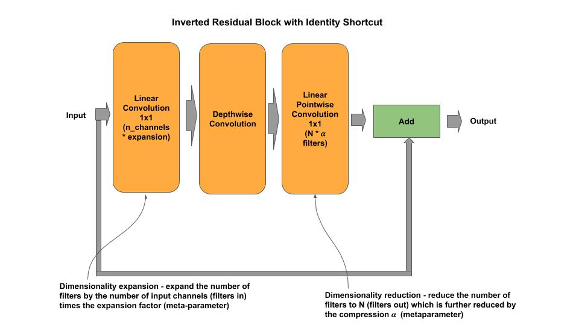

### Strided Inverted Residual Block

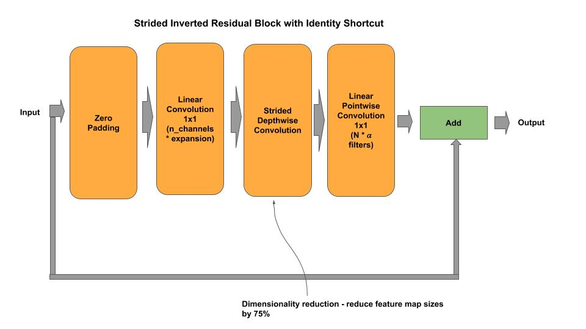

### Classifier


# MobileNet v3.0

[mobilenet(v3).py](mobilenet_v3.py) - academic (idiomatic)<br/>
[mobilenet(v3)_c.py](mobilenet_v3_c.py) - production (composable)

[Paper](https://arxiv.org/pdf/1905.02244.pdf)

## Macro-Architecture

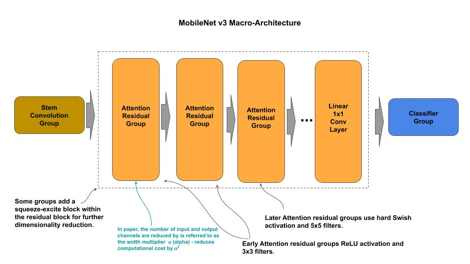

## Micro-Architecture

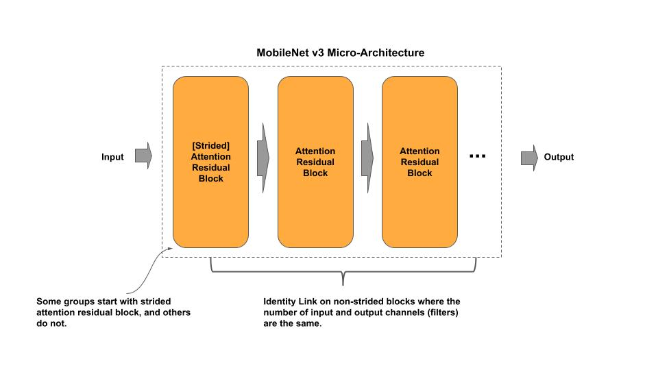

### Stem Group

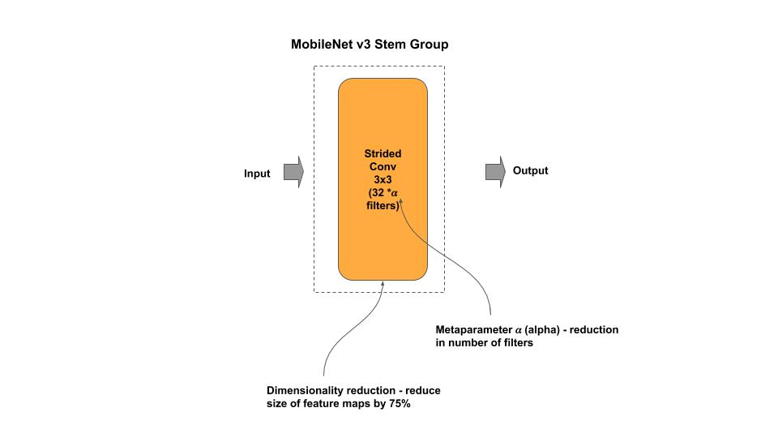

### Attention Block

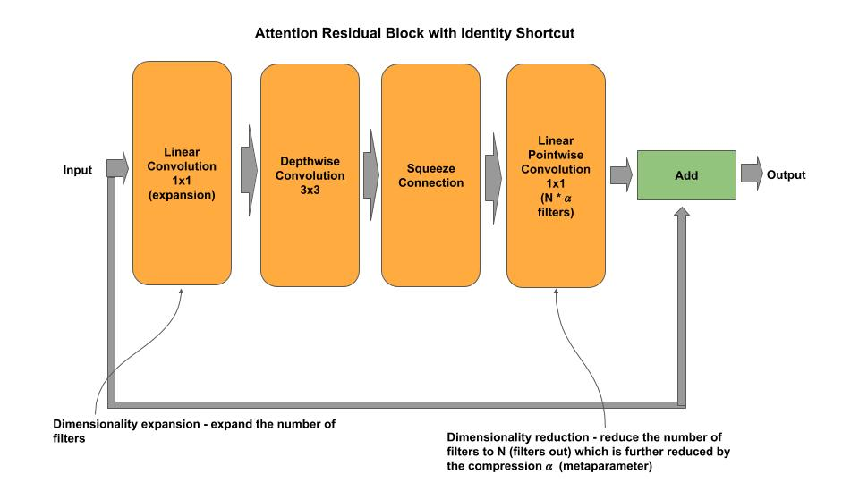

### Squeeze Block

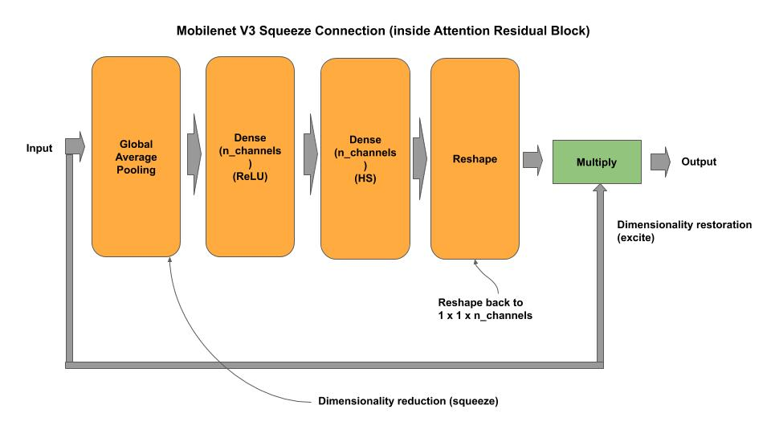

### Classifier Group

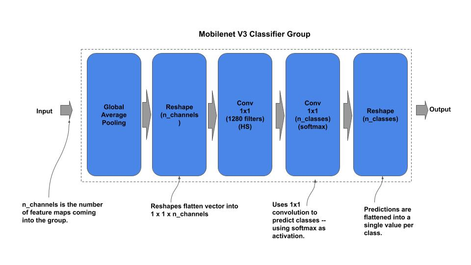


## Composable

*Example: Instantiate a stock MobileNet V2 model*

```python
from mobilenet_v2_c import MobileNetV2

# MobileNet v2.0 from research paper
mobilenet = MobileNetV2()

# MobileNet v2.0 custom input shape/classes
mobilenet = MobileNetV2(input_shape=(128, 128, 3), n_classes=50)

# getter for the tf.keras model
model = mobilenet.model
```

*Example: Composable and Train a MobileNet V1 model*

```python
    ''' Example for constructing/training a MobileNet V1 model on CIFAR-10
    '''
    # Example of constructing a mini-MobileNet
    groups = [ { 'n_filters': 128,  'n_blocks': 1 },
               { 'n_filters': 256,  'n_blocks': 1 },
               { 'n_filters': 1024,  'n_blocks': 2 } ]
    mobilenet = MobileNetV1(groups, input_shape=(32, 32, 3), n_classes=10)
    mobilenet.model.summary()
    mobilenet.cifar10()
```


