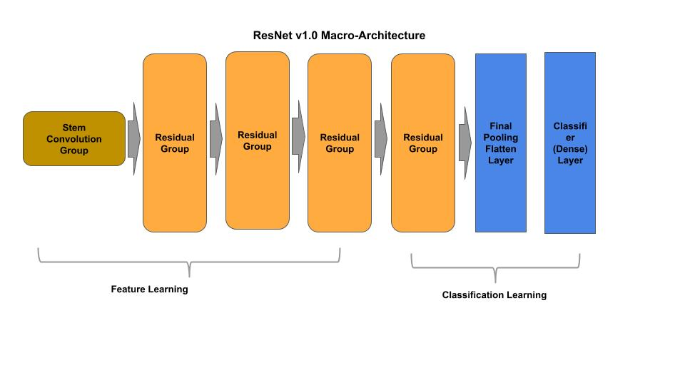
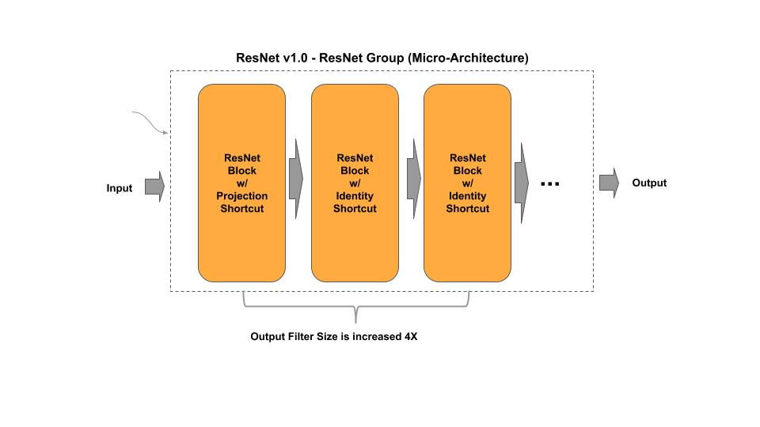
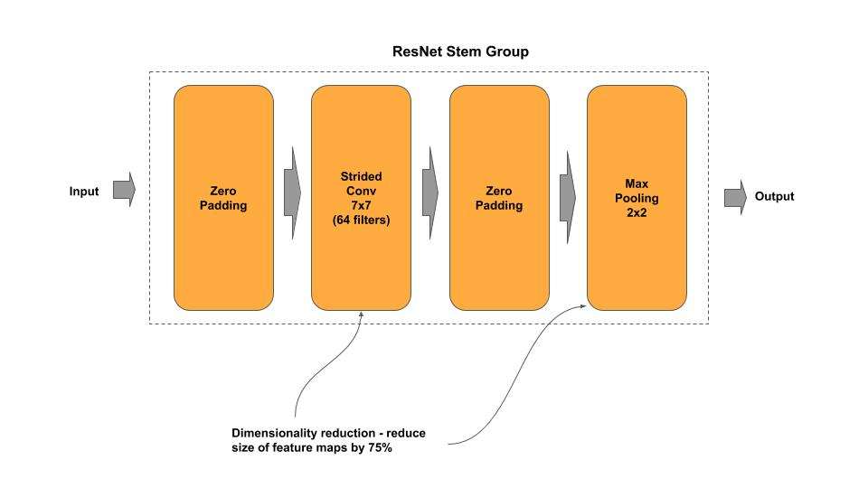
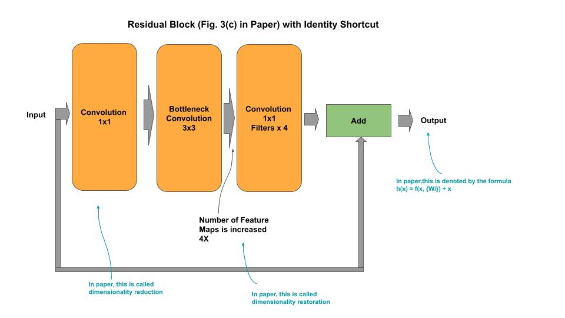
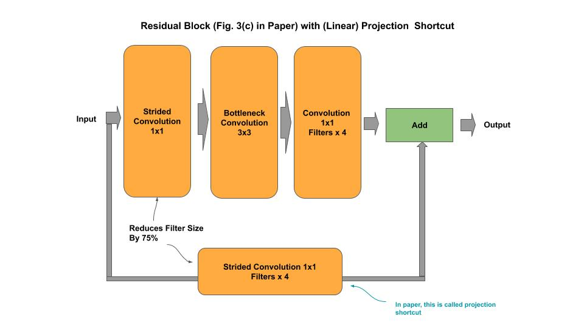
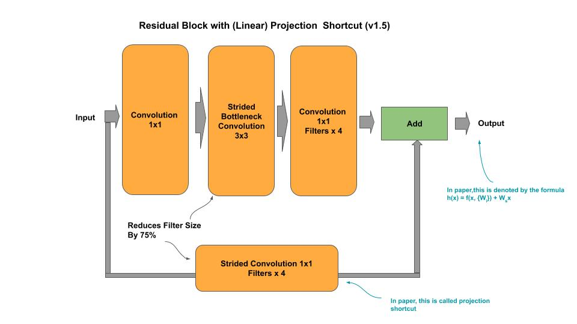

# ResNet

[resnet(v1/v1.5/v2).py](resnet_v1.py) - academic (idiomatic)<br/>
[resnet_cifar10(v1/v2).py](resnet_v1_cifar10.py) - academic (idiomatic)<br/>
[resnet(v1/v1.5/v2)_c.py](resnet_v1_c.py) - production (composable)

[Paper](https://arxiv.org/pdf/1512.03385.pdf)

## Macro-Architecture



## Micro-Architecture



### Stem Group



### ResNet Block with Identity Shortcut



#### v2.0

In v2.0, the BatchNormalization and ReLU activation function is moved from after the convolution to before.

### ResNet Block with Projection Shortcut

#### v1.0



#### v1.5



In v1.5, the strided convolution is moved from the 1x1 convolution to the 3x3 bottleneck convolution.

#### v2.0

In v2.0, the BatchNormalization and ReLU activation function is moved from after the convolution to before.

### Classifier


## Composable

*Example: Instantiate a stock ResNet model*

```python
from resnet_v1_c import ResNetV1

# ResNet50 v1.0 from research paper
resnet = ResNetV1(50)

# ResNet50 v1.0 custom input shape/classes
resnet = ResNetV1(50, input_shape=(128, 128, 3), n_classes=50)

# getter for the tf.keras model
model = resnet.model
```

*Example: Compose and Train a ResNet model*

```python
    ''' Example for constructing/training a ResNet V1 model on CIFAR-10
    '''
    # Example of constructing a mini-ResNet
    groups = [ { 'n_filters' : 64, 'n_blocks': 1 },
               { 'n_filters': 128, 'n_blocks': 2 },
               { 'n_filters': 256, 'n_blocks': 2 }]
    resnet = ResNetV1(groups, input_shape=(32, 32, 3), n_classes=10)
    resnet.model.summary()
    resnet.cifar10()
    ```

