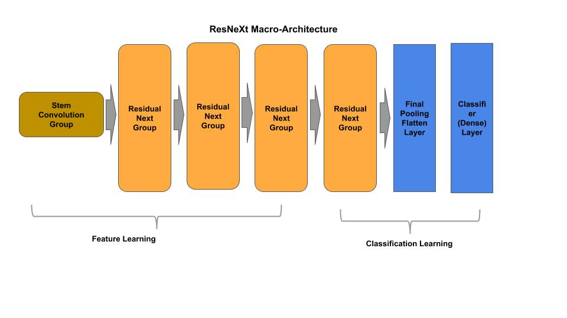
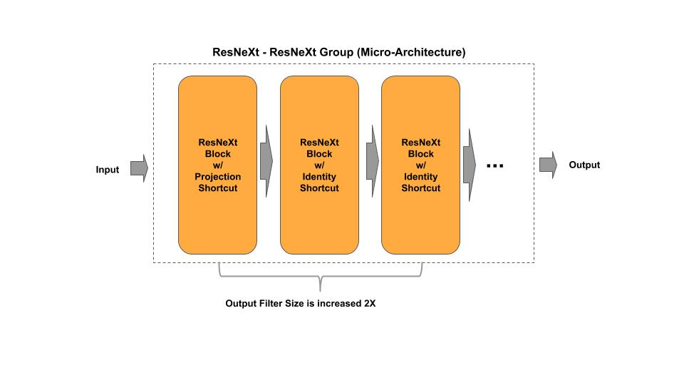
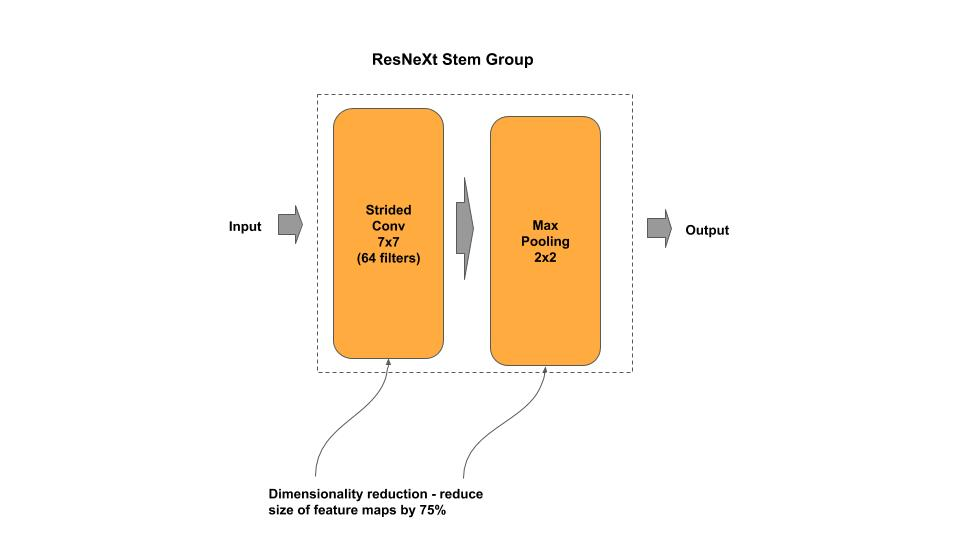
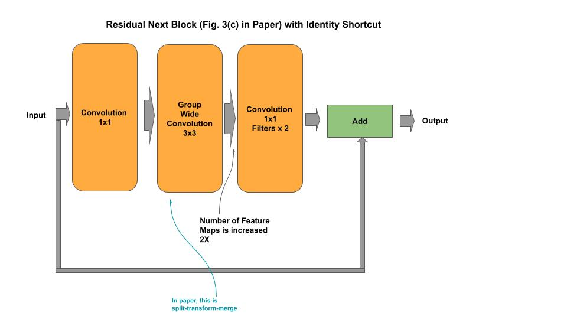
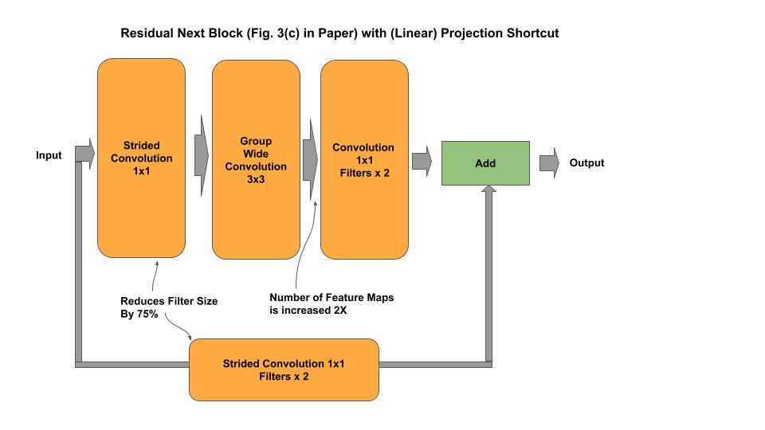
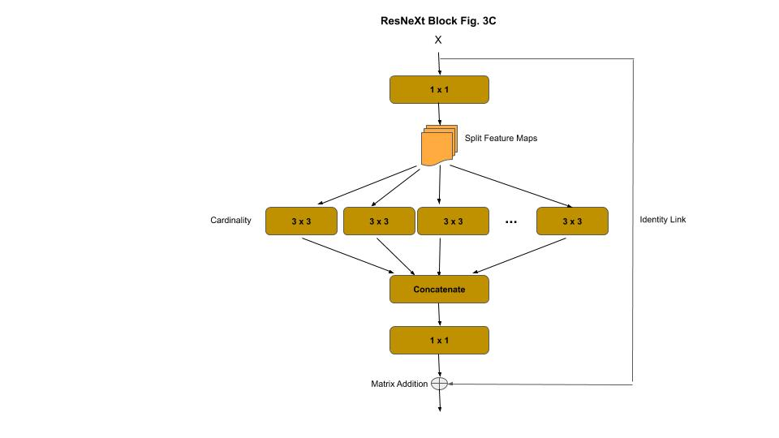
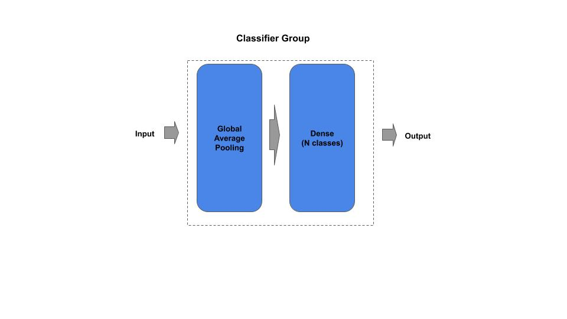

# ResNeXt

[resnext.py](resnext.py) - academic (idiomatic)<br/>
[resnext_cifar10.py](resnext_cifar10.py) - academic (idiomatic)<br/>
[resnext_c.py](resnext_c.py) - production (composable)

[Paper](https://arxiv.org/pdf/1611.05431.pdf)

## Macro-Architecture



## Micro-Architecture



### Stem Group



### ResNeXt Block with Identity Shortcut



### ResNeXt Block with Projection Shortcut



### Cardinality



### Classifier



## Composable

*Example: Instantiate a stock ResNeXt model*

```python
from resnext_c import ResNeXt
# ResNeXt50 from research paper
resnext = ResNeXt(50)

# ResNeXt50 custom input shape/classes
resnext = ResNeXt(50, input_shape=(128, 128, 3), n_classes=50)

# getter for the tf.keras model
model = resnext.model
```

*Example: Compose and Train a ResNext model*

```python
 ''' Example for constructing/training a ResNeXt model on CIFAR-10
    '''
    # Example of constructing a mini-ResNeXt
    groups =  [ { 'filters_in': 128,  'filters_out' : 256,  'n_blocks': 1 },
                { 'filters_in': 256,  'filters_out' : 512,  'n_blocks': 2 },
                { 'filters_in': 512,  'filters_out' : 1024, 'n_blocks': 2 } ]
    resnext = ResNeXt(groups, input_shape=(32, 32, 3), n_classes=10)
    resnext.model.summary()
    resnext.cifar10()
```

