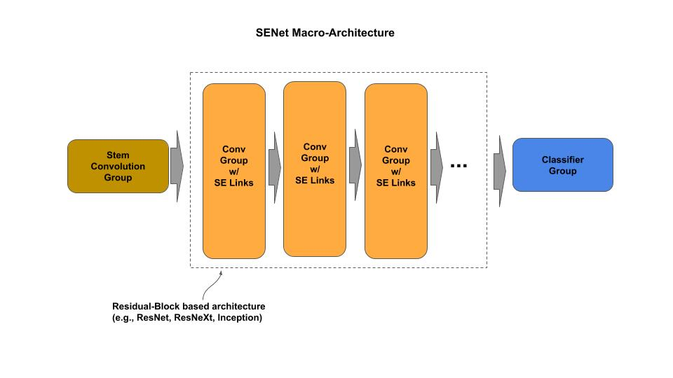
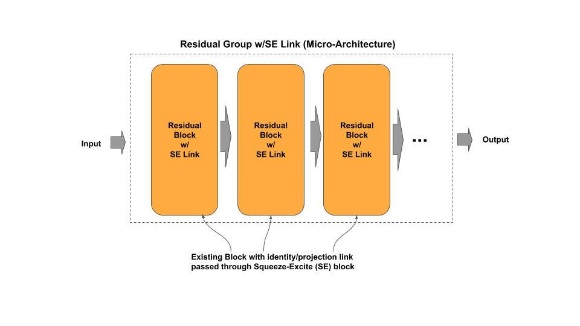
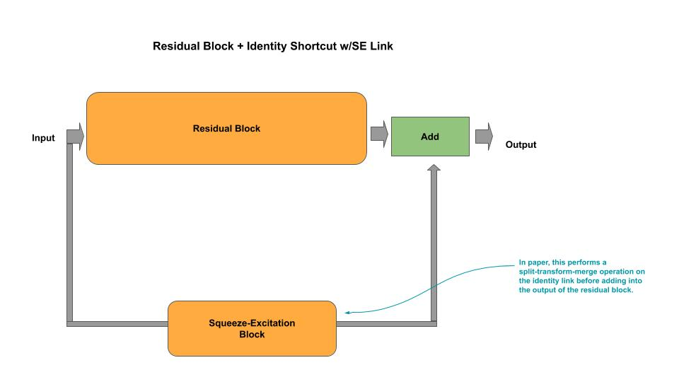
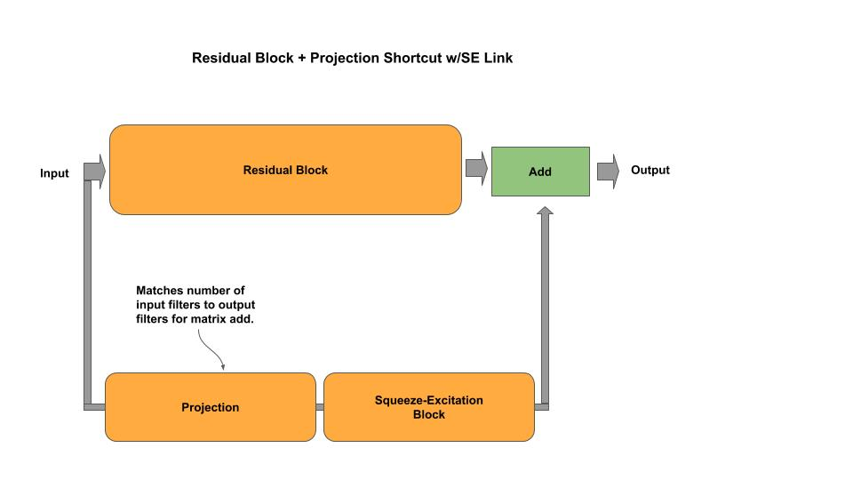
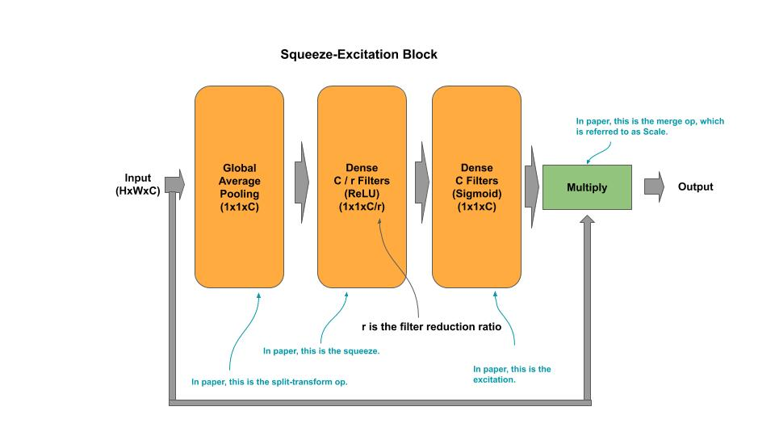

# SE-Net

[se_resnet.py](se_resnet.py) - academic (idiomatic)<br/>
[se_resnext.py](se_resnext.py) - academic (idiomatic)<br/>
[se_resnet_c.py](se_resnet_c.py) - production (composable)<br/>
[se_resnext_c.py](se_resnext_c.py) - production (composable)

[Paper](https://arxiv.org/pdf/1709.01507.pdf)

## Macro-Architecture



## Micro-Architecture



### Residual Block and Identity Shortcut w/SE Link



### Residual Block and Projection Shortcut w/SE Link



### Squeeze-Excitation Block



## Composable

*Example: Instantiate a stock SE-ResNet model*

```python
from se_resnet_c import SEResNet

# SE-ResNet50 from research paper
senet = SEResNet(50)

# ResNet50 custom input shape/classes
senet = SEResNet(50, input_shape=(128, 128, 3), n_classes=50)

# getter for the tf.keras model
model = senet.model
```

*Example: Compose and Train a SE-ResNet*

```python
    ''' Example for constructing/training a SE-ResNet model on CIFAR-10
    '''
    # Example of constructing a mini-ResNet
    groups = [ { 'n_filters' : 64, 'n_blocks': 1 },
               { 'n_filters': 128, 'n_blocks': 2 },
               { 'n_filters': 256, 'n_blocks': 2 } ]
    senet = SEResNet(groups, input_shape=(32, 32, 3), n_classes=10)
    senet.model.compile(loss='sparse_categorical_crossentropy', optimizer='adam', metrics=['acc'])
    senet.model.summary()
    senet.cifar10()
```
