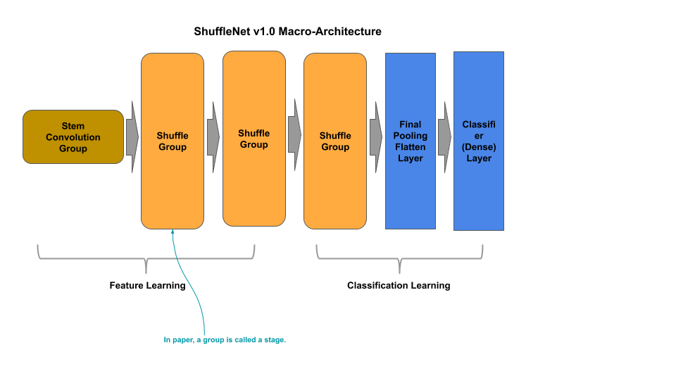
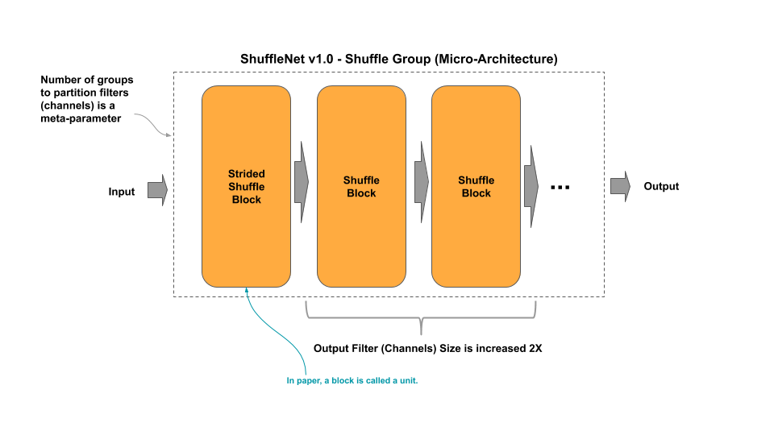
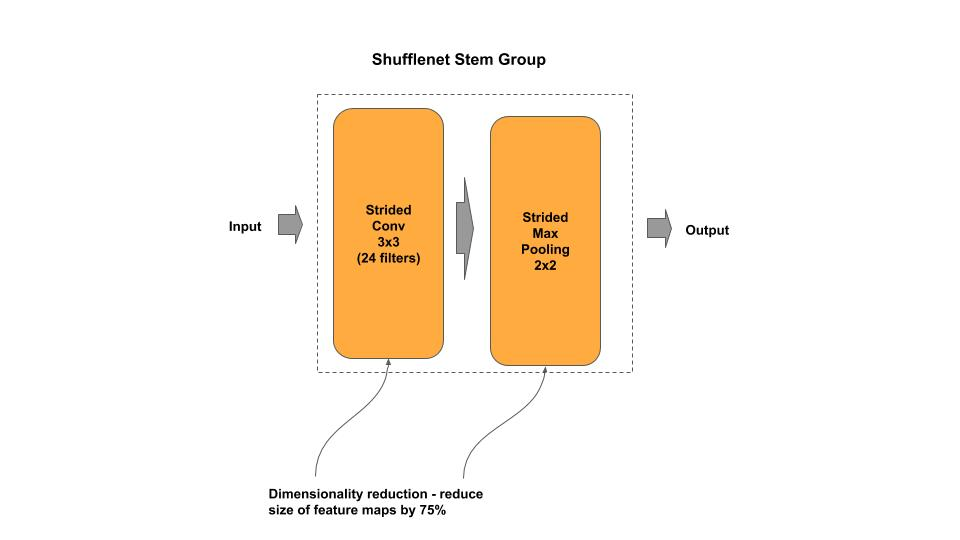
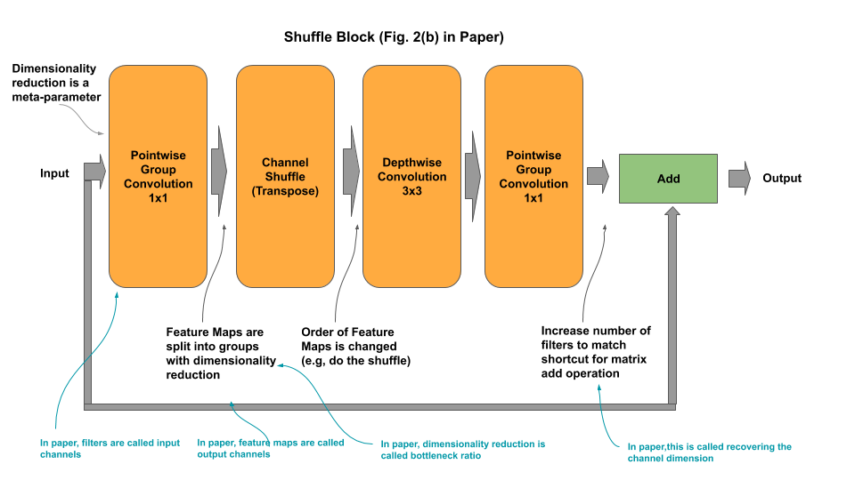

# ShuffleNet v1.0

[shufflenet.py](shufflenet.py) - academic (idiomatic)<br/>
[shufflenet_c.py](shufflenet_c.py) - production (composable)

[Paper](https://arxiv.org/pdf/1707.01083.pdf)

## Macro-Architecture



## Micro-Architecture



### Stem Group



### Shuffle Block


### Strided Shuffle Block



### Classifier


## Composable

*Example: Instantiate a stock ShuffleNet model*

```python
from shufflenet_c import ShuffleNet

# ShuffleNet v1 from research paper
shufflenet = ShuffleNet()

# ShuffleNet v1 custom input shape/classes
shufflenet = ShuffleNet(input_shape=(128, 128, 3), n_classes=50)

# getter for the tf.keras model
model = shufflenet.model
```

*Example: Compose and Train a ShuffleNet model*

```python
    ''' Example for constructing/training a ShuffleNet model on CIFAR-10
    '''
    # Example of constructing a mini-ShuffleNet
    groups  = [ { 'n_blocks' : 2 }, { 'n_blocks' : 4 } ]
    shufflenet = ShuffleNet(groups, input_shape=(32, 32, 3), n_classes=10)
    shufflenet.model.compile(loss='sparse_categorical_crossentropy', optimizer='adam', metrics=['acc'])
    shufflenet.model.summary()
    shufflenet.cifar10()
    ```
