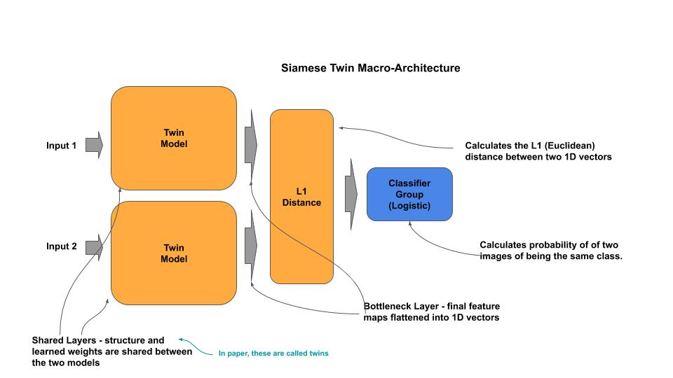
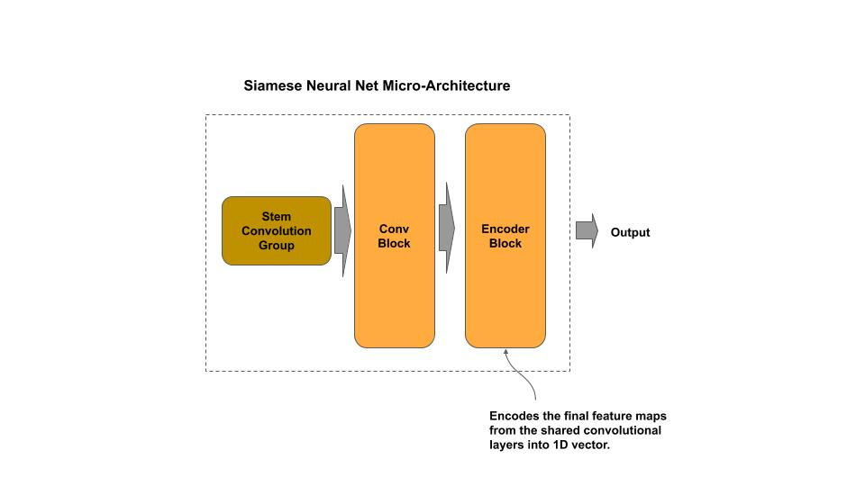
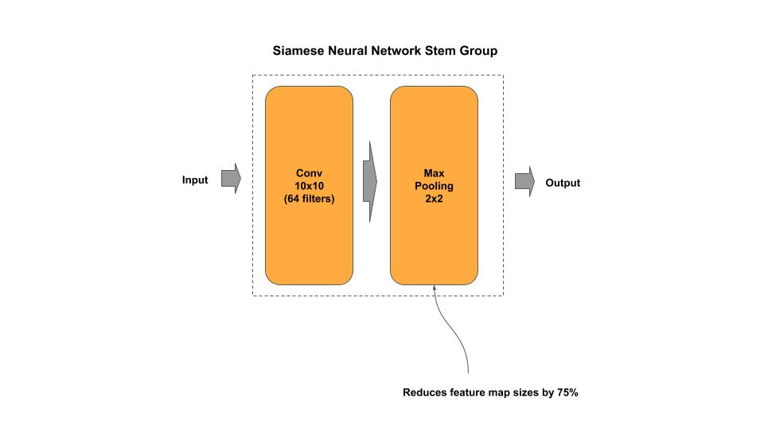
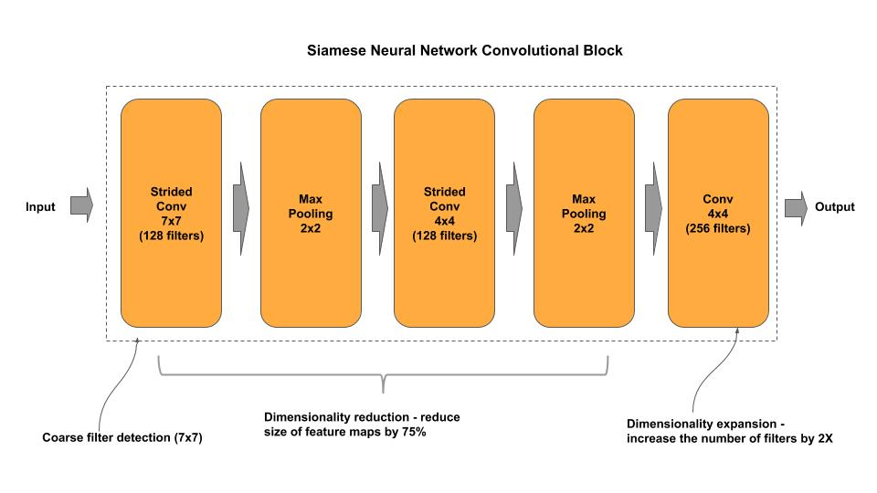
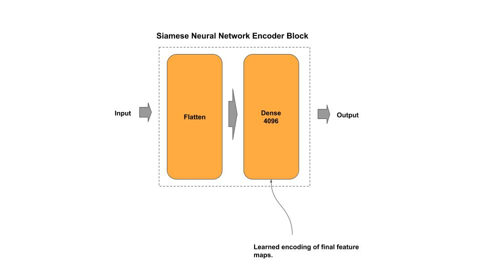
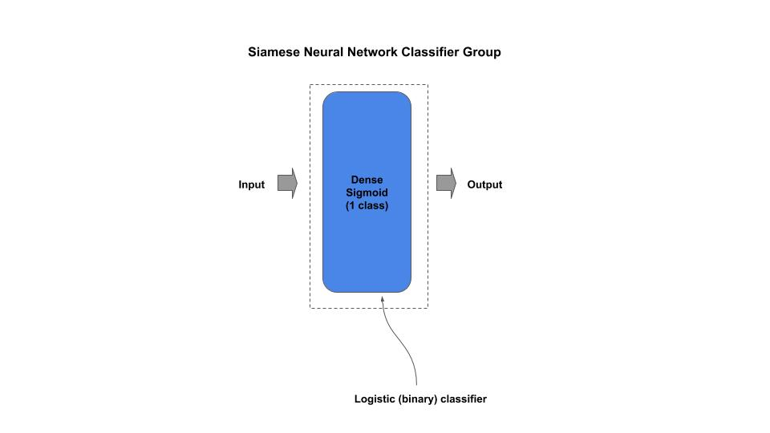

# Siamese Neural Network

[siamese_twin.py](siamese_twin.py) - academic (idiomatic)
[siamese_twin_c.py](siamese_twin_c.py) - production (composable)

[Paper](https://www.cs.cmu.edu/~rsalakhu/papers/oneshot1.pdf)

## Macro-Architecture

### Siamese Neural Network



### Twin Micro-Architecture



### Stem Group



### Convolutional Block



### Encoder 



### Classifier Group



## Composable

*Example: Instantiate a stock Siamese Twin model*/

```python
from siamese_twin_c import SiameseTwin

# Siamese Twin from research paper
siam = SiameseTwin()

# getter for the tf.keras model
model = siam.model
```

