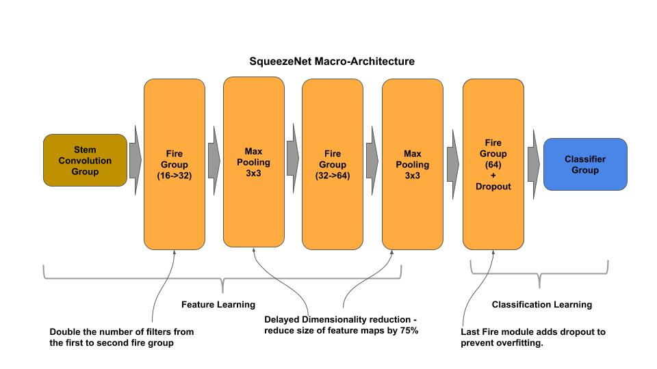
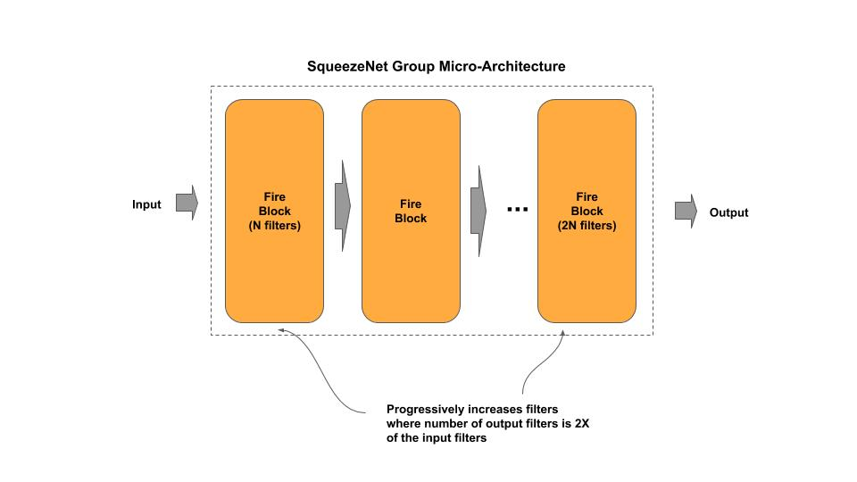
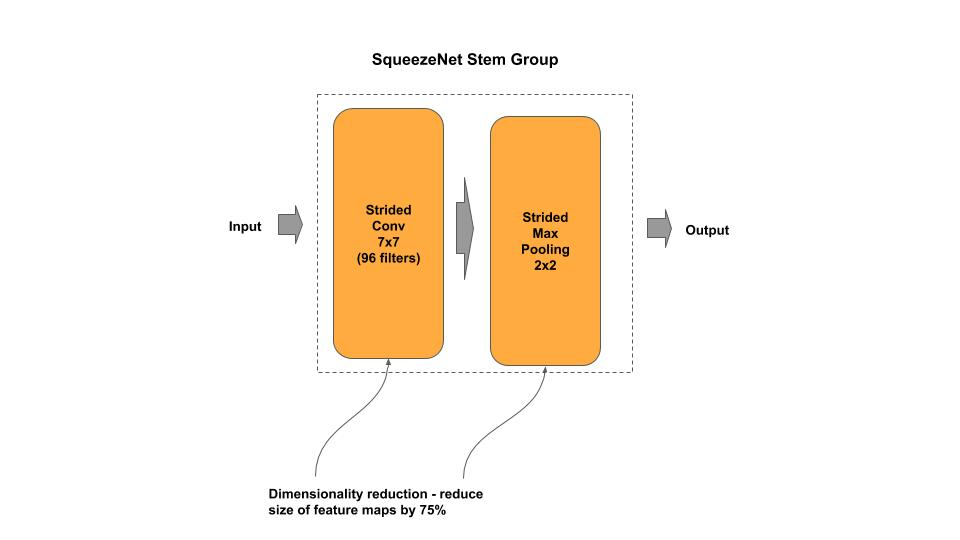
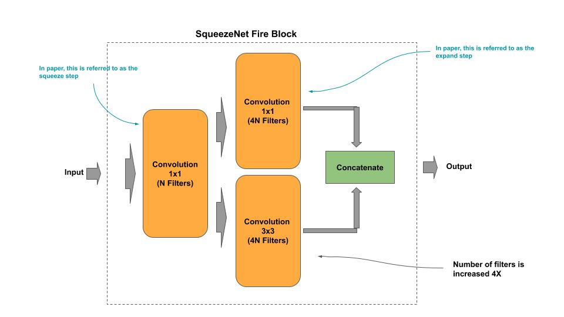
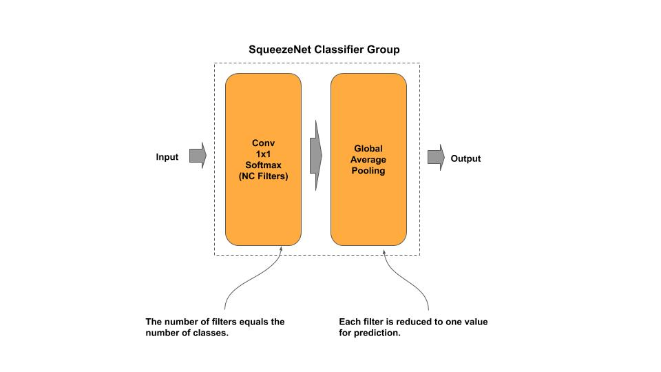
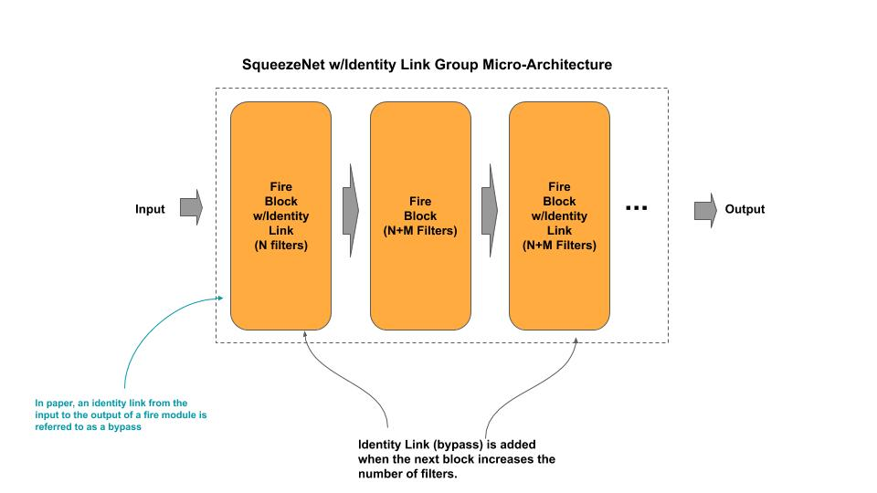
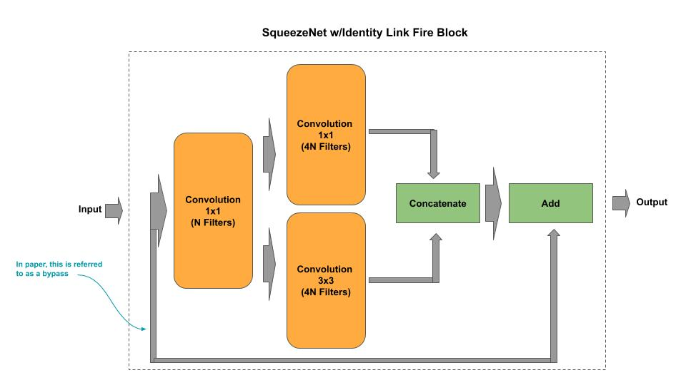
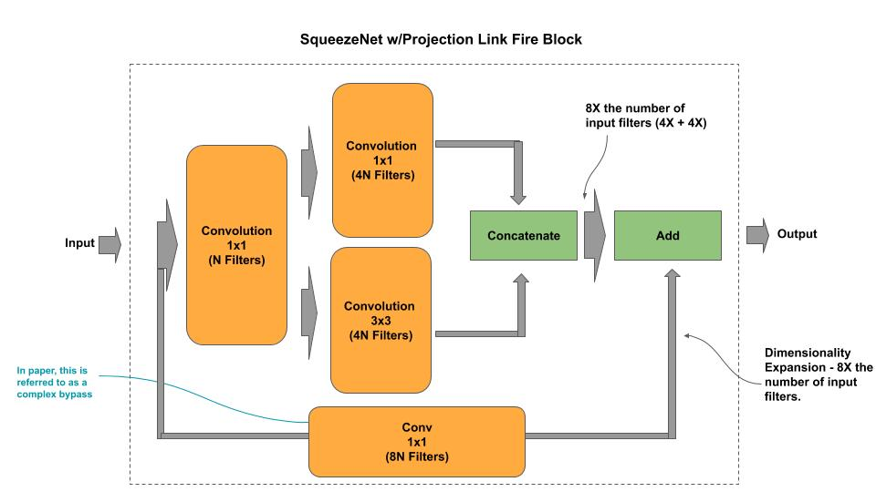

# SqueezeNet

[squeezenet(_bypass/_complex).py](squeezenet.py) - academic (idiomatic)<br/>
[squeezenet(_bypass/_complex)_c.py](squeezenet_c.py) - production (composable)

[Paper](https://arxiv.org/pdf/1602.07360.pdf)

## Macro-Architecture



## Micro-Architecture



### Stem Group



### Fire Block



### Classifier Group



## Fire Bypass Micro-Archirecture



### Fire Bypass Block



## Fire Complex Bypass Micro-Archirecture


### Fire Complex Bypass Block



## Composable

*Example: Instantiate a stock SqueezeNet model*

```python
from squeezenet_c import SqueezeNet
# SqueezeNet from research paper
squeezenet = SqueezeNet()

# ResNeXt50 custom input shape/classes
squeezenet = SqueezeNet(input_shape=(128, 128, 3), n_classes=50)

# getter for the tf.keras model
model = squeezenet.model
```

*Example: Compose and Train a SqueezeNet model*

```python
    ''' Example for constructing/training a SqueezeNet model on CIFAR-10
    '''
    # Example of constructing a mini-SqueezeNet
    groups = [ [ { 'n_filters' : 16 }, { 'n_filters' : 16 }, { 'n_filters' : 32 } ],
               [ { 'n_filters' : 64 } ] ]
    squeezenet = SqueezeNet(groups, input_shape=(32, 32, 3), n_classes=10)
    squeezenet.model.summary()
    squeezenet.cifar10()
```
