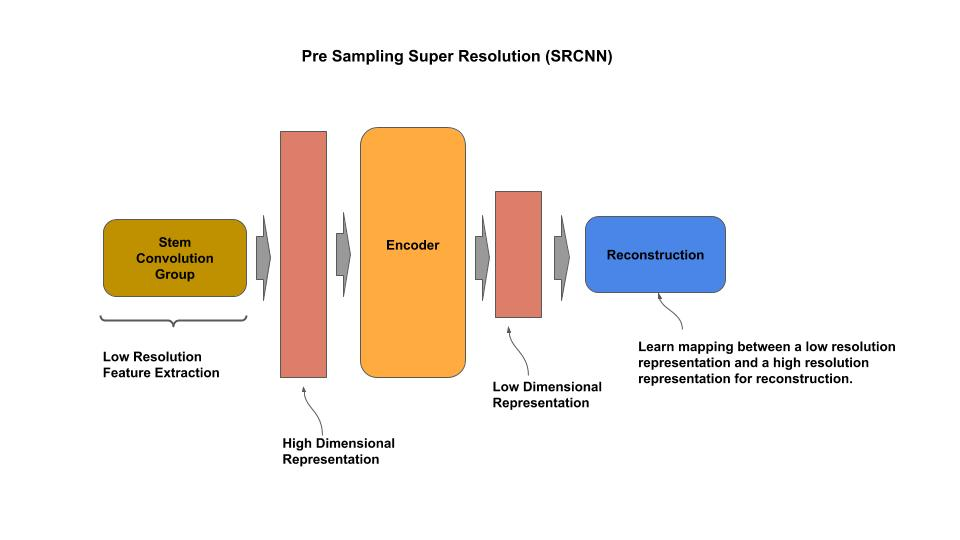
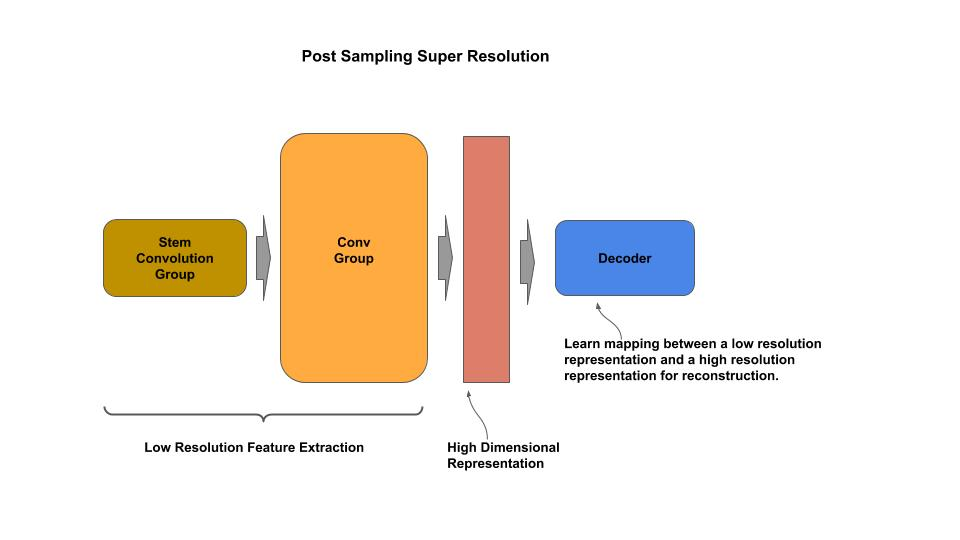

# SRCNN

[srcnn.py](srcnn.py) - academic (idiomatic) 
[srcnn-post.py](srcnn-post.py) - academic (idiomatic) 
[srcnn_c.py](srcnn_c.py) - production (composable) 
[srcnn-post_c.py](srcnn-post_c.py) - production (composable) 

[Paper](https://arxiv.org/pdf/1501.00092.pdf)

## Macro-Architecture

### Pre-Upsampling SR

### Post-Upsampling SR

