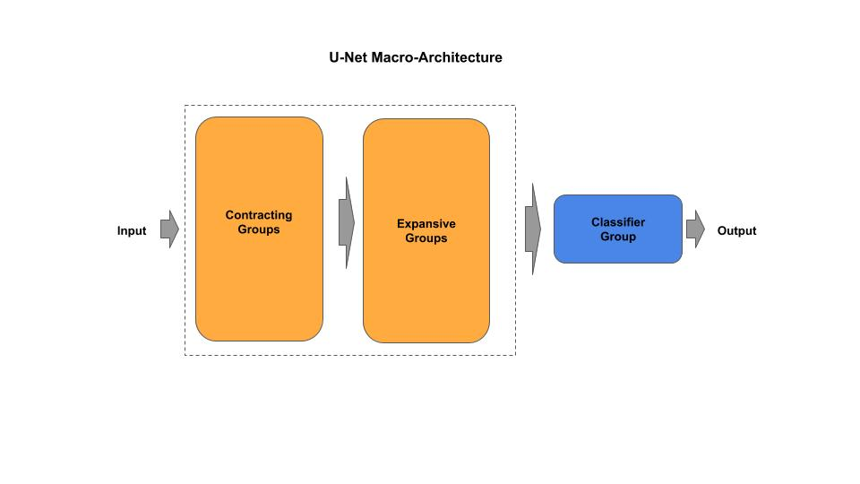
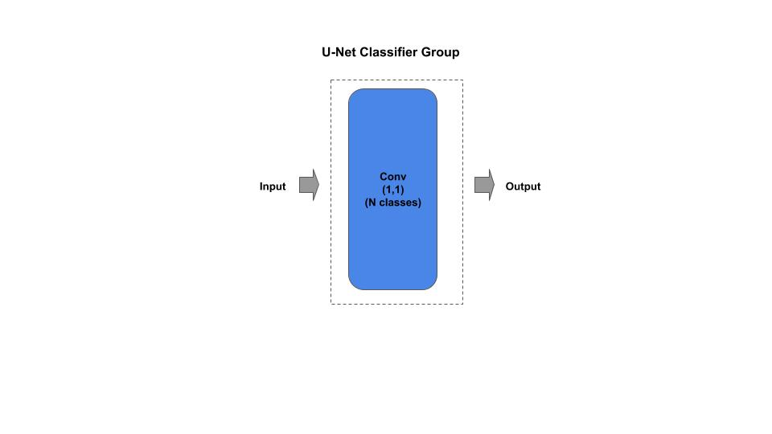

# U-Net

[unet_c.py](unet_c.py) - production (composable)

[Paper](https://arxiv.org/pdf/1505.04597.pdf)

## Macro-Architecture




## Micro-Architecture

### Contracting Group


### Expanding Group


### Classifier



## Composable

*Example: Instantiate a stock U-Net model*

```python
from unet_c import UNet

# U-Net from research paper
resnet = UNet()

# getter for the tf.keras model
model = unet.model
```
