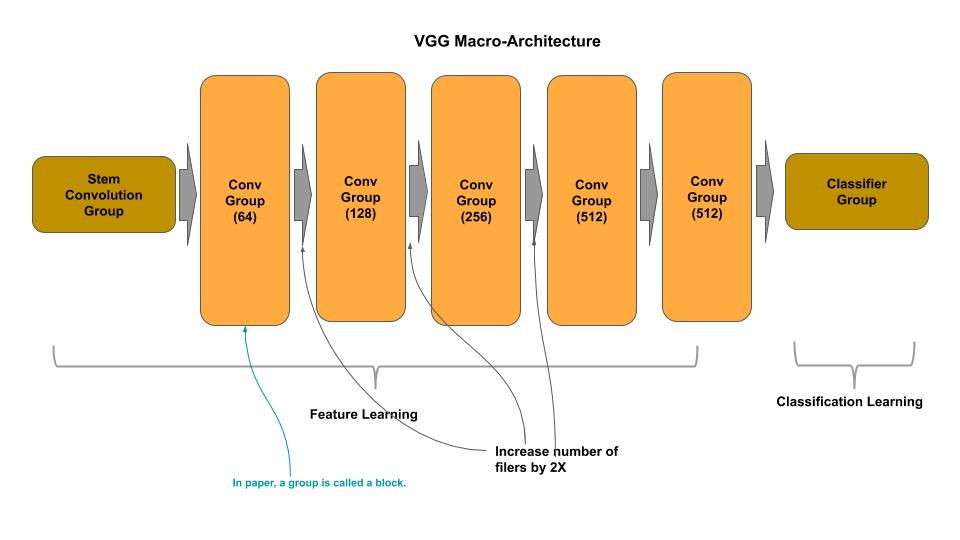
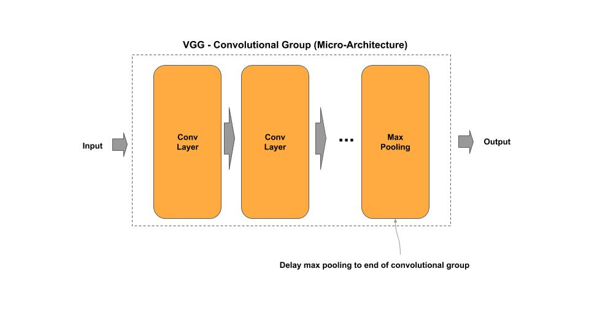
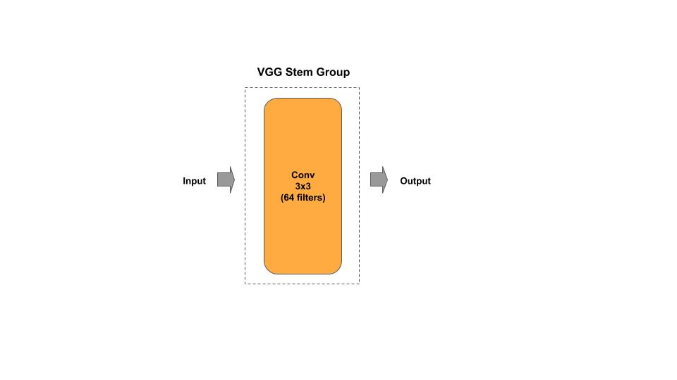
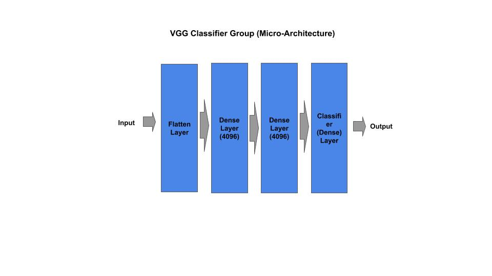

# VGG

    vgg.py   - academic (idiomatic)
    vgg_c.py - production (composable)

[Paper](https://arxiv.org/pdf/1409.1556.pdf)

## Macro-Architecture



## Micro-Architecture 

### Convolutional Group (Block)



### Stem Group



### Classifier Group



## Composable

*Example Instantiate a stock VGG model*

```python
from vgg_c import VGG

# VGG16 from research paper
vgg = VGG(16)

# VGG16 custom input shape/classes
vgg = VGG(16, input_shape=(128, 128, 3), n_classes=50)

# getter for the tf.keras model
model = vgg.model
```

*Example: Compose and train a mini-VGG model*

```python
''' Example for constructing/training a VGG model on CIFAR-10
'''
# Example of constructing a mini-VGG
groups = [ { 'n_layers': 1, 'n_filters': 64 },
           { 'n_layers': 2, 'n_filters': 128 },
           { 'n_layers': 2, 'n_filters': 256 } ]
vgg = VGG(groups, input_shape=(32, 32, 3), n_classes=10)
vgg.model.summary()

# train on CIFAR-10
vgg.cifar10()
```

