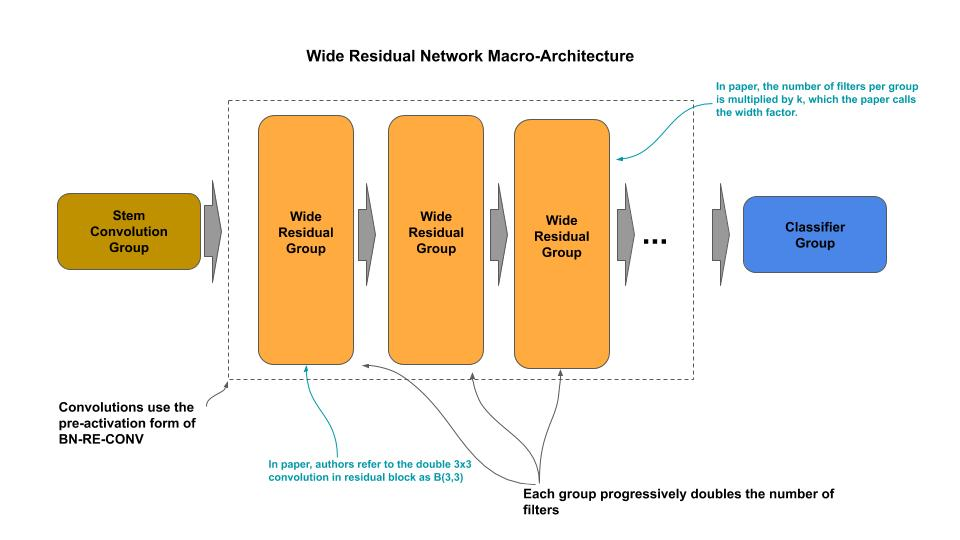
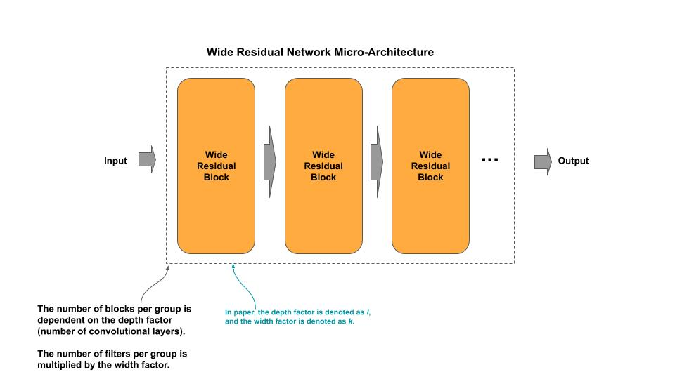
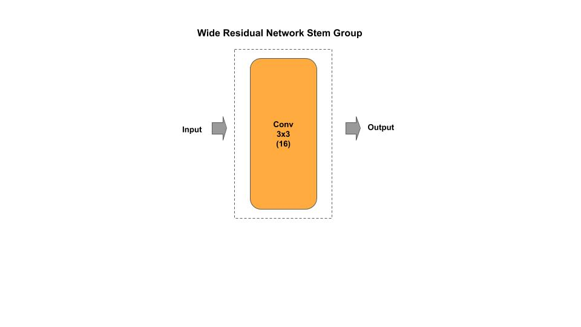
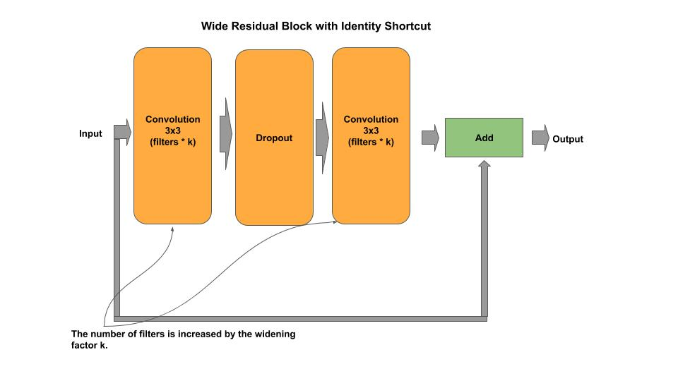
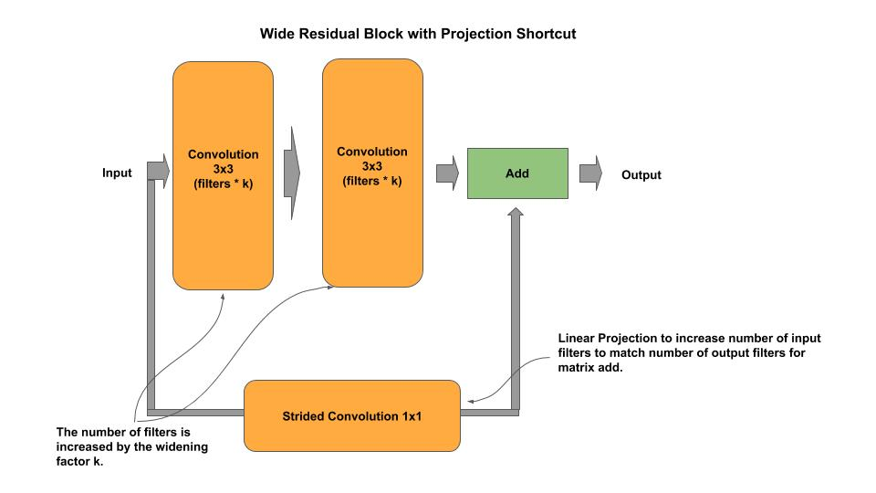
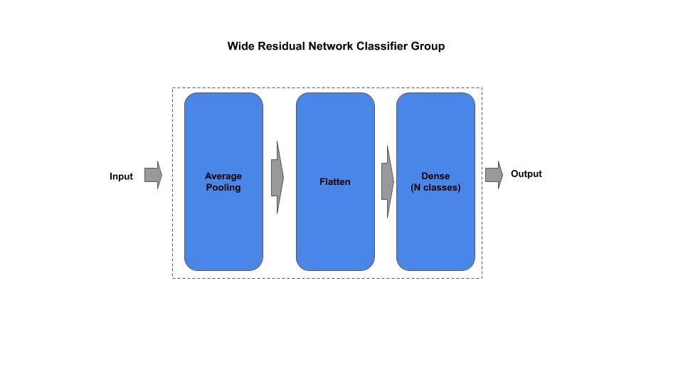

# WRN (Wide Residual Network)

[wrn_c.py](wrn_c.p) - production (composable)

[Paper](https://arxiv.org/pdf/1605.07146.pdf)

## Macro-Architecture



## Micro-Architecture



### Stem Group



### Wide Residual Block with Identity Link



### Wide Residual Block with Projection Shortcut



### Classifier Group



## Composable

*Example: Instantiate a stock WRN model*

```python
from wrn_c import WRN

wrn = WRN(depth=28, k=10)
```

*Example: Compose and Train a WRN model*

```python
 example():
    ''' Example for constructing/training a WRN model on CIFAR-10
    '''
    # Example of constructing a mini WRN
    wrn = WRN(depth=14, k=2, input_shape=(32, 32, 3), n_classes=10)
    wrn.model.compile(loss='sparse_categorical_crossentropy', optimizer='adam', metrics=['acc'])
    wrn.model.summary()
    wrn.cifar10()
```
