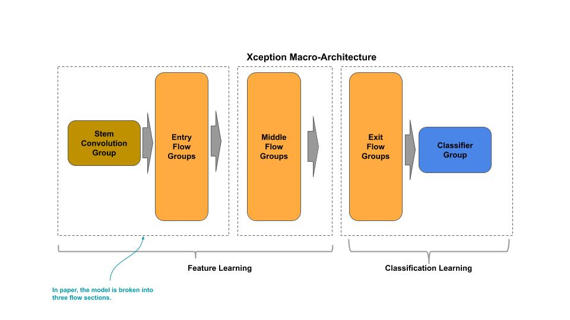
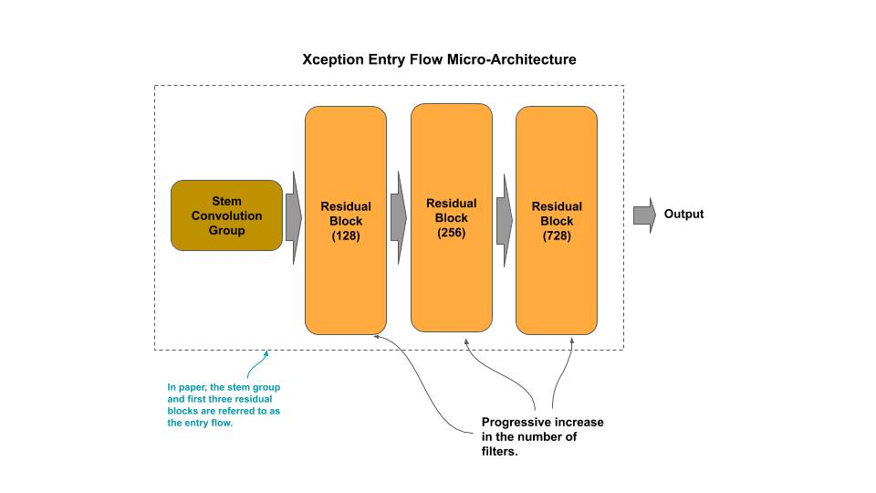
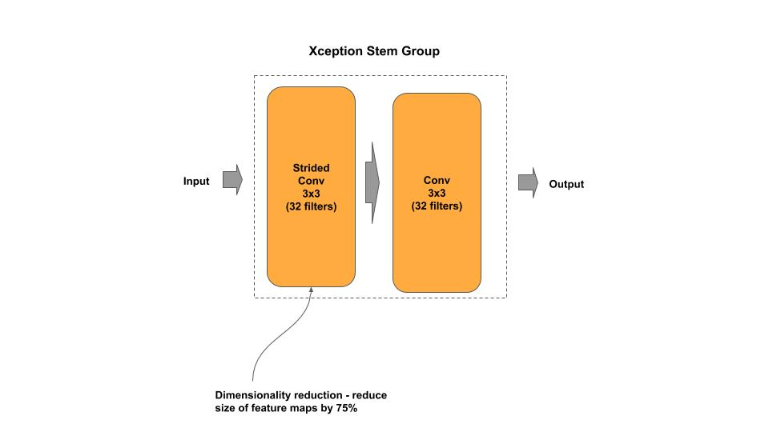
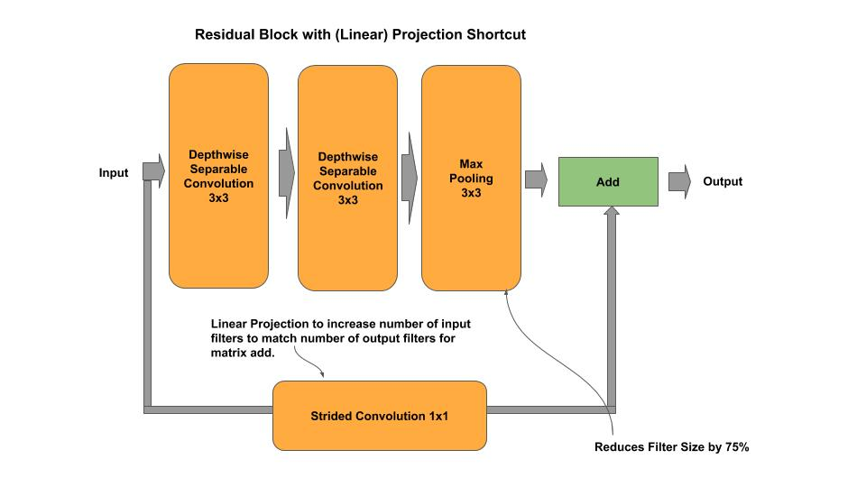
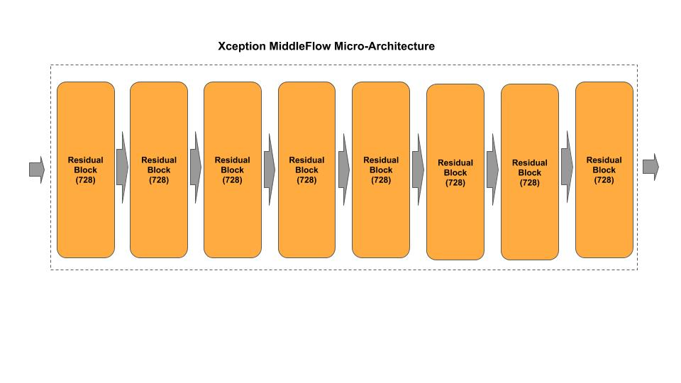
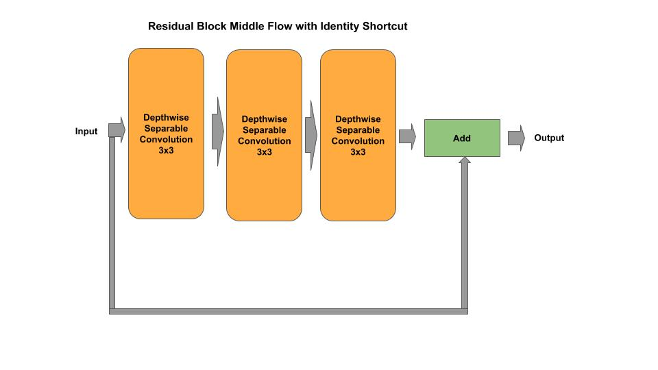
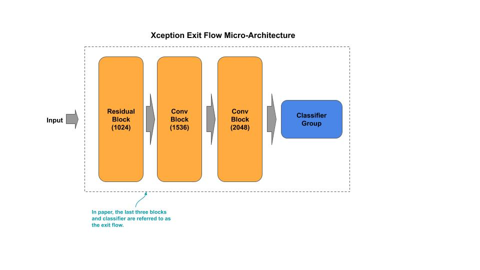
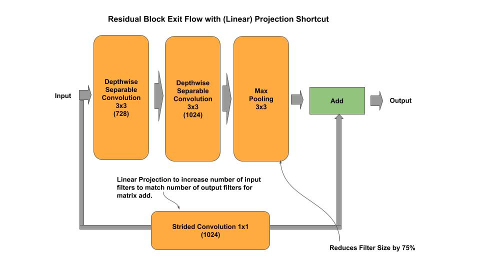
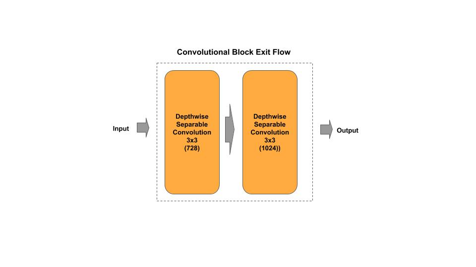
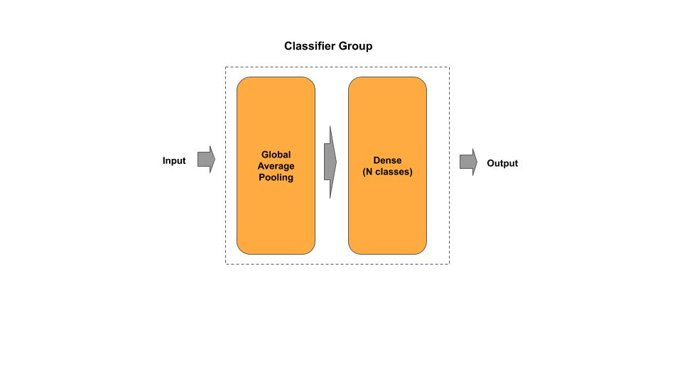

# Xception

[xception.py](xception.py) - academic (idiomatic)<br/>
[xception_c.py](xception_c.py) - production (composable)<br/>

[Paper](https://arxiv.org/pdf/1610.02357.pdf)

## Macro-Architecture



## Micro-Architecture - Entry Flow



### Entry Flow Stem Group



### Entry Flow Block



## Micro-Architecture - Middle Flow



### Middle Flow Block



## Micro-Architecture - Exit Flow



### Exit Flow Residual Block



### Exit Flow Convolutional Block



### Exit Flow Classifier



## Composable

*Example: Instantiate a stock Xception model*

```python
from xception_c import Xception

# Xception from research paper
xception = Xception()

# Xception custom input shape/classes
xception = Xception(input_shape=(128, 128, 3), n_classes=50)

# getter for the tf.keras model
model = xception.model
```

*Example: Compose and Train an Xception model*

```python
    ''' Example for constructing/training a Xception model on CIFAR-10
    '''
    # Example of constructing a mini-Xception
    entry  = [{ 'n_filters' : 128 }, { 'n_filters' : 728 }]
    middle = [{ 'n_filters' : 728 }, { 'n_filters' : 728 }, { 'n_filters' : 728 }]

    xception = Xception(entry=entry, middle=middle, input_shape=(32, 32, 3), n_classes=10)
    xception.model.summary()
    xception.cifar10()
```
